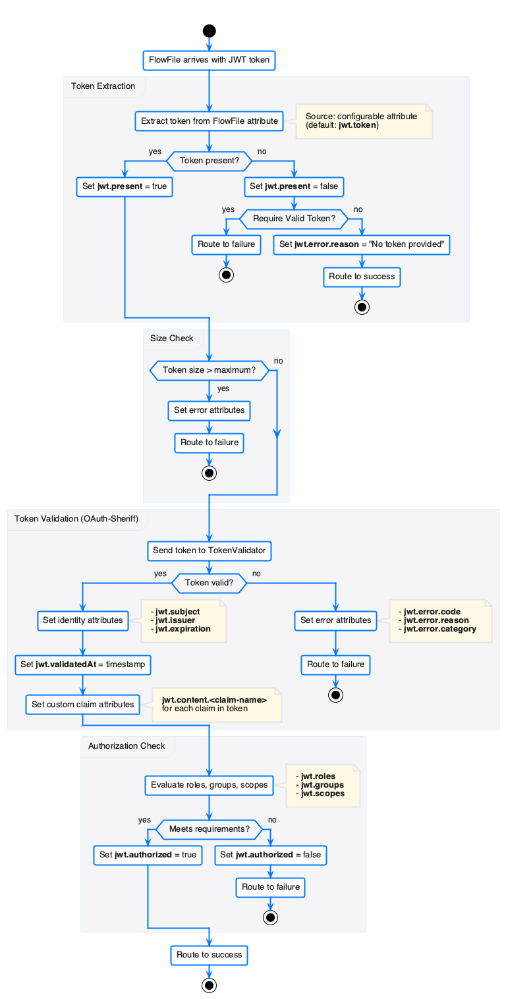

= NiFi JWT Authentication Processor
:toc:
:toclevels: 2

image:https://github.com/cuioss/nifi-extensions/actions/workflows/maven.yml/badge.svg[Java CI with Maven,link=https://github.com/cuioss/nifi-extensions/actions/workflows/maven.yml]
image:https://github.com/cuioss/nifi-extensions/actions/workflows/e2e-tests.yml/badge.svg[End-to-End Tests,link=https://github.com/cuioss/nifi-extensions/actions/workflows/e2e-tests.yml]
image:http://img.shields.io/:license-apache-blue.svg[License,link=http://www.apache.org/licenses/LICENSE-2.0.html]
image:https://img.shields.io/maven-central/v/de.cuioss.nifi/nifi-extensions.svg?label=Maven%20Central["Maven Central", link="https://search.maven.org/artifact/de.cuioss.nifi/nifi-extensions"]

https://sonarcloud.io/summary/new_code?id=cuioss_nifi-extensions[image:https://sonarcloud.io/api/project_badges/measure?project=cuioss_nifi-extensions&metric=alert_status[Quality Gate Status]]
image:https://sonarcloud.io/api/project_badges/measure?project=cuioss_nifi-extensions&metric=ncloc[Lines of Code,link=https://sonarcloud.io/summary/new_code?id=cuioss_nifi-extensions]
image:https://sonarcloud.io/api/project_badges/measure?project=cuioss_nifi-extensions&metric=coverage[Coverage,link=https://sonarcloud.io/summary/new_code?id=cuioss_nifi-extensions]

== What is it?

A custom https://nifi.apache.org/[Apache NiFi] processor that validates JWT tokens against multiple identity providers in a single flow. It validates JWT signatures, checks expiration and audience claims, and supports multiple identity providers (e.g. Keycloak, Entra ID, Auth0) simultaneously -- with automatic JWKS key rotation and caching. Built for NiFi 2.6.0.

== The Problem

NiFi flows that consume REST APIs or process webhook payloads often receive JWT-authenticated requests. Out of the box, NiFi has no processor to validate these tokens. This forces teams to either:

* write custom scripts inside `ExecuteScript` processors with no key rotation or caching,
* call an external validation service, adding latency and a point of failure, or
* skip token validation entirely and trust the upstream reverse proxy.

== The Solution

This processor drops into any NiFi flow as a single node. It extracts the JWT, validates it against one or more JWKS endpoints, and writes the token claims as FlowFile attributes -- ready for downstream routing and processing.

== Installation

The only artifact you need is the **NAR file** (NiFi Archive). It bundles the processor, the configuration UI, and all dependencies.

=== From a Release

. Download `nifi-cuioss-nar-<version>.nar` from https://github.com/cuioss/nifi-extensions/releases[GitHub Releases] or https://search.maven.org/artifact/de.cuioss.nifi/nifi-cuioss-nar[Maven Central].
. Copy the NAR into your NiFi extensions directory:
+
[source,bash]
----
cp nifi-cuioss-nar-*.nar $NIFI_HOME/extensions/
----
. Restart NiFi (or wait for NiFi's auto-detection if configured).
. The processor **MultiIssuerJWTTokenAuthenticator** appears in the "Add Processor" dialog under the tags `jwt`, `oauth`, `authentication`.

=== From Source

[source,bash]
----
git clone https://github.com/cuioss/nifi-extensions.git
cd nifi-extensions
./mvnw clean install -DskipTests
cp nifi-cuioss-nar/target/nifi-cuioss-nar-*.nar $NIFI_HOME/extensions/
----

=== Docker / Kubernetes

Mount or copy the NAR into the container's extensions directory:

[source,yaml]
----
# Docker Compose example
services:
  nifi:
    image: apache/nifi:2.6.0
    volumes:
      - ./nifi-cuioss-nar-1.0-SNAPSHOT.nar:/opt/nifi/nifi-current/extensions/nifi-cuioss-nar.nar:ro
----

== Configuration

The processor can be configured through three methods (in order of precedence):

. **Static configuration files** -- for automated / container deployments
. **Environment variables** -- for container orchestration (Kubernetes, Docker)
. **NiFi UI** -- interactive configuration with built-in JWKS validation and token testing

See the link:doc/guides/QuickStart.adoc[Quick Start Guide] for a step-by-step walkthrough covering processor properties, issuer configuration, relationships, output attributes, static files, and environment variables.

== Components

[cols="1,3"]
|===
|Module |Purpose

|link:nifi-cuioss-processors/README.md[nifi-cuioss-processors]
|JWT processor implementation, token validation, configuration management

|link:nifi-cuioss-ui/[nifi-cuioss-ui]
|Custom NiFi UI with JWKS validation, token verification, and metrics tabs

|link:nifi-cuioss-nar/[nifi-cuioss-nar]
|NiFi Archive (NAR) -- the deployable artifact bundling processors + UI

|link:integration-testing/README.adoc[integration-testing]
|Docker-based test environment (NiFi + Keycloak)

|link:e-2-e-playwright/README.adoc[e-2-e-playwright]
|Playwright E2E and WCAG accessibility tests
|===

== Documentation

=== Specifications

* link:doc/Requirements.adoc[Requirements]
* link:doc/Specification.adoc[Specification]
* link:doc/specification/configuration.adoc[Configuration Reference]
* link:doc/specification/configuration-static.adoc[Static Configuration & Container Deployment]
* link:doc/specification/configuration-ui.adoc[UI Configuration]
* link:doc/specification/security.adoc[Security]
* link:doc/specification/token-validation.adoc[Token Validation]
* link:doc/specification/technical-components.adoc[Technical Components]

=== Guides

* link:doc/guides/QuickStart.adoc[Quick Start Guide] -- get running in under 5 minutes
* link:doc/guides/IssuerConfigPropertiesGuide.adoc[Issuer Configuration Walkthrough] -- step-by-step UI configuration with test environment and troubleshooting

=== Testing

* link:integration-testing/README.adoc[Integration Testing Environment] -- Docker setup with NiFi and Keycloak
* link:e-2-e-playwright/README.adoc[End-to-End Testing] -- Playwright tests for processor UI and WCAG compliance
* link:e-2-e-playwright/docs/accessibility-testing-guide.adoc[Accessibility Testing Guide]

=== Development

* link:doc/specification/error-handling.adoc[Error Handling]
* link:doc/specification/internationalization.adoc[Internationalization]
* link:doc/specification/observability.adoc[Observability & Metrics]
* link:doc/LogMessages.adoc[Log Messages Reference]

== Building

[source,bash]
----
./mvnw clean install                    # Full build with tests
./mvnw clean install -DskipTests        # Build without tests
----

=== Code Quality

[source,bash]
----
./mvnw -Ppre-commit clean install -DskipTests   # Pre-commit quality checks
./mvnw clean verify -Psonar                      # SonarQube analysis
----

This project follows centralized coding standards from https://github.com/cuioss/cui-llm-rules[cui-llm-rules] covering https://github.com/cuioss/cui-llm-rules/tree/main/standards/java[Java], https://github.com/cuioss/cui-llm-rules/tree/main/standards/javascript[JavaScript], https://github.com/cuioss/cui-llm-rules/tree/main/standards/testing[testing], and https://github.com/cuioss/cui-llm-rules/tree/main/standards/documentation[documentation].

=== Integration & E2E Tests

[source,bash]
----
# Start Docker test environment (NiFi + Keycloak)
./integration-testing/src/main/docker/run-and-deploy.sh

# Run integration tests via Maven
./mvnw integration-test -Plocal-integration-tests -Dintegration.test.local=true

# Run Playwright E2E tests directly
cd e-2-e-playwright && npm run playwright:test
----

See link:integration-testing/README.adoc[Integration Testing] and link:e-2-e-playwright/README.adoc[E2E Testing] for detailed instructions.
