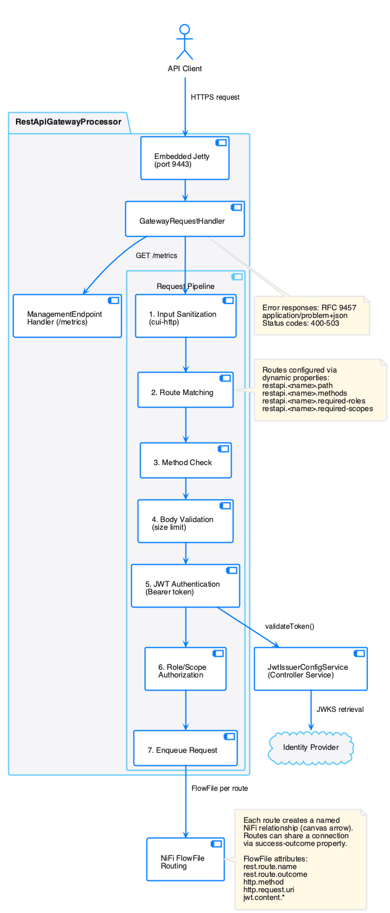

= NiFi Extensions -- JWT Authentication and REST API Gateway
:toc:
:toclevels: 2

image:https://github.com/cuioss/nifi-extensions/actions/workflows/maven.yml/badge.svg[Java CI with Maven,link=https://github.com/cuioss/nifi-extensions/actions/workflows/maven.yml]
image:https://github.com/cuioss/nifi-extensions/actions/workflows/e2e-tests.yml/badge.svg[End-to-End Tests,link=https://github.com/cuioss/nifi-extensions/actions/workflows/e2e-tests.yml]
image:https://github.com/cuioss/nifi-extensions/actions/workflows/integration-tests.yml/badge.svg[Integration Tests,link=https://github.com/cuioss/nifi-extensions/actions/workflows/integration-tests.yml]

image:https://img.shields.io/badge/Apache%20NiFi-2.8.0-1f6aa5[Apache NiFi,link=https://nifi.apache.org/]
image:https://img.shields.io/badge/Java-21-ed8b00[Java 21,link=https://openjdk.org/projects/jdk/21/]
image:http://img.shields.io/:license-apache-blue.svg[License,link=http://www.apache.org/licenses/LICENSE-2.0.html]
image:https://img.shields.io/maven-central/v/de.cuioss.nifi/nifi-extensions.svg?label=Maven%20Central["Maven Central", link="https://search.maven.org/artifact/de.cuioss.nifi/nifi-extensions"]

https://sonarcloud.io/summary/new_code?id=cuioss_nifi-extensions[image:https://sonarcloud.io/api/project_badges/measure?project=cuioss_nifi-extensions&metric=alert_status[Quality Gate Status]]
image:https://sonarcloud.io/api/project_badges/measure?project=cuioss_nifi-extensions&metric=ncloc[Lines of Code,link=https://sonarcloud.io/summary/new_code?id=cuioss_nifi-extensions]
image:https://sonarcloud.io/api/project_badges/measure?project=cuioss_nifi-extensions&metric=coverage[Coverage,link=https://sonarcloud.io/summary/new_code?id=cuioss_nifi-extensions]

== What is it?

A self-contained REST API gateway for https://nifi.apache.org/[Apache NiFi]. The **RestApiGatewayProcessor** embeds a Jetty HTTP server with route-based dispatching, per-route JWT authorization, and RFC 9457 error responses -- replacing multi-processor gateway patterns with a single node.

The project also includes a **MultiIssuerJWTTokenAuthenticator** for FlowFile-based JWT validation (see link:doc/guides/MultiIssuerJWTTokenAuthenticatorGuide.adoc[MultiIssuerJWTTokenAuthenticator Guide]).
Both processors share JWT validation through a common **JwtIssuerConfigService** Controller Service supporting multiple identity providers (Keycloak, Entra ID, Auth0) with automatic JWKS key rotation and caching.

== The Problem

Building a REST API gateway in NiFi manually requires chaining `HandleHttpRequest` + custom validation + `HandleHttpResponse` with complex error routing.
Adding JWT authentication on top means even more processors, relationships, and configuration -- all for what should be a single concern.

== The Solution

The `RestApiGatewayProcessor` is a single processor that embeds an HTTP server, authenticates and authorizes requests per-route, and converts them into FlowFiles.

Key capabilities:

* **Route-based dispatching** -- define routes via dynamic properties, each with its own HTTP methods and path patterns
* **Per-route JWT authorization** -- require specific roles for individual routes
* **RFC 9457 error responses** -- standardized problem details for authentication and authorization failures
* **Management endpoints** -- `/metrics` (Prometheus-compatible) and `/health`

== Installation

You need **two NAR files** (NiFi Archives):

* **`nifi-cuioss-api-nar`** -- Controller Service API interfaces (required by NiFi 2.x classloader separation)
* **`nifi-cuioss-nar`** -- Processors, Controller Service implementation, configuration UI, and all dependencies

NiFi 2.x requires that Controller Service API interfaces reside in a separate NAR from their implementations. Both NARs must be deployed together.

=== From a Release

. Download both `nifi-cuioss-api-nar-<version>.nar` and `nifi-cuioss-nar-<version>.nar` from https://github.com/cuioss/nifi-extensions/releases[GitHub Releases] or https://search.maven.org/artifact/de.cuioss.nifi/nifi-cuioss-nar[Maven Central].
. Copy both NARs into your NiFi extensions directory:
+
[source,bash]
----
cp nifi-cuioss-api-nar-*.nar nifi-cuioss-nar-*.nar $NIFI_HOME/extensions/
----
. Restart NiFi (or wait for NiFi's auto-detection if configured).
. The processors **MultiIssuerJWTTokenAuthenticator** and **RestApiGatewayProcessor** appear in the "Add Processor" dialog under the tags `jwt` and `authentication`.

== Configuration

Both processors can be configured through three methods (highest precedence first):

. **NiFi UI** -- interactive configuration with built-in JWKS validation and token testing
. **Environment variables** -- for container orchestration (Kubernetes, Docker)
. **Static configuration files** -- for automated / container deployments

See the link:doc/guides/QuickStart.adoc[Quick Start Guide] for a step-by-step walkthrough covering processor properties, issuer configuration, routes, relationships, and the custom UI. For static configuration files and environment variables, see the link:doc/reference/configuration.adoc[Configuration Reference].

=== Sandbox

A local sandbox spins up NiFi and Keycloak in Docker so you can explore both processors with a real identity provider.

[source,bash]
----
./integration-testing/src/main/docker/run-and-deploy.sh
----

The script builds the NAR, copies it into the deployment directory, and starts the containers.
NiFi takes about 60-80 seconds to become healthy.

[cols="1,2,1"]
|===
|Service |URL |Credentials

|NiFi
|https://localhost:9095/nifi
|`testUser` / `drowssap`

|Keycloak
|https://localhost:9085
|`admin` / `admin`
|===

After code changes, redeploy NiFi without restarting Keycloak:

[source,bash]
----
./integration-testing/src/main/docker/redeploy-nifi.sh
----

Stop the sandbox:

[source,bash]
----
cd integration-testing/src/main/docker && docker compose down -v
----

The sandbox includes a pre-configured NiFi flow (link:integration-testing/src/main/docker/nifi/conf/flow.json[flow.json]) with a `RestApiGatewayProcessor` on port 9443 featuring multi-route JWT authorization via Keycloak, RFC 9457 error responses, and a `/metrics` management endpoint.
The flow also contains a `MultiIssuerJWTTokenAuthenticator`-based endpoint on port 7777 (see link:doc/guides/MultiIssuerJWTTokenAuthenticatorGuide.adoc[MultiIssuerJWTTokenAuthenticator Guide]).

== Components

[cols="1,3"]
|===
|Module |Purpose

|link:nifi-cuioss-api/[nifi-cuioss-api]
|Controller Service API types (`JwtIssuerConfigService` interface, `JwtAuthenticationConfig` record)

|link:nifi-cuioss-api-nar/[nifi-cuioss-api-nar]
|NiFi Archive (NAR) for the API -- required by NiFi 2.x classloader separation

|link:nifi-cuioss-common/[nifi-cuioss-common]
|Shared JWT infrastructure: Controller Service implementation, configuration, utilities

|link:nifi-cuioss-processors/[nifi-cuioss-processors]
|`MultiIssuerJWTTokenAuthenticator` -- FlowFile-based JWT validation processor

|link:nifi-cuioss-rest-processors/[nifi-cuioss-rest-processors]
|`RestApiGatewayProcessor` -- REST API gateway with embedded Jetty, route-based dispatching, RFC 9457 errors

|link:nifi-cuioss-ui/[nifi-cuioss-ui]
|Unified Custom UI serving both processors -- issuer configuration, token verification, endpoint configuration, metrics

|link:nifi-cuioss-nar/[nifi-cuioss-nar]
|NiFi Archive (NAR) -- the main deployable artifact bundling processors + UI

|link:integration-testing/README.adoc[integration-testing]
|Docker-based test environment (NiFi + Keycloak)

|link:e-2-e-playwright/README.adoc[e-2-e-playwright]
|Playwright E2E and WCAG accessibility tests
|===

== Documentation

=== Architecture

* link:doc/architecture/README.adoc[Architecture Overview] -- module overview, "which processor" decision guide
* link:doc/architecture/gateway.adoc[Gateway Architecture] -- pipeline, auth layers, metrics, error handling
* link:doc/architecture/jwt-processor.adoc[JWT Processor Architecture] -- flow, attributes, OAuth-Sheriff lifecycle
* link:doc/architecture/standards.adoc[Standards Compliance] -- RFC/standards compliance table

=== Guides

* link:doc/guides/QuickStart.adoc[Quick Start Guide] -- RestApiGateway setup in under 5 minutes
* link:doc/guides/MultiIssuerJWTTokenAuthenticatorGuide.adoc[MultiIssuerJWTTokenAuthenticator Guide] -- FlowFile-based JWT validation with integration test flow
* link:doc/guides/IssuerConfigPropertiesGuide.adoc[Issuer Configuration Walkthrough] -- step-by-step UI configuration with test environment and troubleshooting
* link:doc/guides/BuildingGuide.adoc[Building Guide] -- build, code quality, SonarQube, integration and E2E tests

=== Reference

* link:doc/reference/configuration.adoc[Configuration Reference] -- all property tables, static config, environment variables
* link:doc/reference/error-reference.adoc[Error Reference (RFC 9457)] -- consolidated error types returned by the gateway

=== Testing

* link:integration-testing/README.adoc[Integration Testing Environment] -- Docker setup with NiFi and Keycloak
* link:e-2-e-playwright/README.adoc[End-to-End Testing] -- Playwright tests for processor UI and WCAG compliance
* link:e-2-e-playwright/docs/accessibility-testing-guide.adoc[Accessibility Testing Guide]

== Building

See the link:doc/guides/BuildingGuide.adoc[Building Guide] for build commands, code quality checks, SonarQube analysis, and integration/E2E test instructions.
