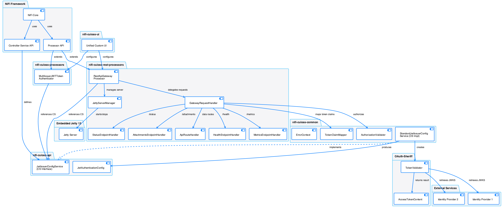

= MultiIssuerJWTTokenAuthenticator Specification
:toc:
:toclevels: 3
:toc-title: Table of Contents
:sectnums:

== Overview
_See Requirement link:Requirements.adoc#NIFI-AUTH-1[NIFI-AUTH-1: REST API Support Enhancement]_

This document provides the technical specification for implementing the MultiIssuerJWTTokenAuthenticator processor.
For functional requirements, see link:Requirements.adoc[Requirements Document].

The MultiIssuerJWTTokenAuthenticator is compatible with NiFi 2.4.0 and leverages the cui-jwt-validation library for token validation.

== Document Structure
_See Requirement link:Requirements.adoc#NIFI-AUTH-13[NIFI-AUTH-13: Documentation Requirements]_
This specification is organized into the following documents:

* link:specification/technical-components.adoc[Technical Components] - Core implementation details
* link:specification/configuration.adoc[Configuration] - Configuration properties and UI
* link:specification/token-validation.adoc[Token Validation] - Token validation implementation
* link:specification/token-factory-manager.adoc[Token Factory Manager] - Token factory creation and caching
* link:specification/error-handling.adoc[Error Handling] - Error handling implementation
* link:specification/testing.adoc[Testing] - Unit and integration testing
* link:specification/security.adoc[Security] - Security considerations
* link:specification/integration-patterns.adoc[Integration Patterns] - Integration examples
* link:specification/internationalization.adoc[Internationalization] - i18n implementation
* link:LogMessage.md[Log Messages] - Log message documentation

== Libraries and Dependencies

The MultiIssuerJWTTokenAuthenticator uses the following key dependencies:

=== Runtime Dependencies
* Apache NiFi 2.4.0
* cui-jwt-validation 1.0.0
* Caffeine 3.2.0 (for caching)
* Jakarta JSON API 2.1.3
* Parsson 1.1.7
* Bouncy Castle (bcprov-jdk18on-1.80.jar) for cryptographic operations

=== Test Dependencies
* cui-test-mockwebserver-junit5 (for unit testing JWKS endpoints)
* cui-test-keycloak-integration (for integration testing with real tokens)
* JUnit 5 with JUnit Jupiter for modern testing approaches
* Mockito for mocking dependencies during testing

These libraries provide a robust foundation for implementing and testing JWT authentication in NiFi 2.4.0 environments.

== Key Technical Features

The MultiIssuerJWTTokenAuthenticator processor implements the following key technical features:

=== Multiple Issuer Support
_See Requirement link:Requirements.adoc#NIFI-AUTH-2[NIFI-AUTH-2: Multi-issuer Support]_

The processor supports configuring multiple JWT token issuers, each with its own:
* JWKS URL for key retrieval
* Audience validation requirements
* Required scopes
* Accepted algorithms

=== Token Validation
_See Requirement link:Requirements.adoc#NIFI-AUTH-3[NIFI-AUTH-3: Token Validation Requirements]_

The processor validates JWT tokens using the cui-jwt-validation library with:
* Signature validation against JWKS keys
* Standard JWT claims validation (exp, nbf, iat, iss, aud)
* Custom scope and role validation
* Support for all standard JWT algorithms including RS256, RS384, RS512, PS256, PS384, PS512, ES256, ES384, and ES512

=== Static Configuration Support
_See Requirement link:Requirements.adoc#NIFI-AUTH-7.7[NIFI-AUTH-7.7: Static Configuration for Container Environments]_

The processor supports static configuration for container deployments:
* Configuration via properties files (.properties), YAML (.yml, .yaml), or JSON (.json)
* Active by default when present
* Environment variable and system property support for configuration paths
* Configuration displayed (read-only) in the UI when static configuration is active
* Automatic reloading of configuration changes
* Comprehensive documentation for container deployment scenarios

=== Caching and Performance
_See Requirement link:Requirements.adoc#NIFI-AUTH-4[NIFI-AUTH-4: Performance Requirements]_

The processor implements efficient caching for:
* JWKS keys with configurable refresh intervals
* Validated tokens with configurable TTL
* Rejected tokens with negative caching to prevent DDOS

=== Security Features
_See Requirement link:Requirements.adoc#NIFI-AUTH-9[NIFI-AUTH-9: Security Requirements]_

The processor implements strong security practices:
* No storage of private keys
* Secure HTTP communication for JWKS retrieval
* Secure defaults for all configuration properties
* Circuit breaker pattern for JWKS endpoint failures
* Protection against common JWT attacks (algorithm confusion, replay attacks)

=== Error Handling
_See Requirement link:Requirements.adoc#NIFI-AUTH-10[NIFI-AUTH-10: Error Handling Requirements]_

The processor provides comprehensive error handling:
* Standardized error codes with consistent messages
* Detailed logging at appropriate levels
* Flow file routing based on error type
* Meaningful flow file attributes for debugging

=== Testing Framework
_See Requirement link:Requirements.adoc#NIFI-AUTH-11[NIFI-AUTH-11: Testing Requirements]_

The processor includes:
* Comprehensive unit tests with JUnit 5
* Integration tests using cui-test-keycloak-integration
* Mock JWKS server tests with cui-test-mockwebserver-junit5
* Performance tests with defined SLAs

== Architecture Overview

The high-level architecture of the MultiIssuerJWTTokenAuthenticator consists of the following components:

== Implementation Notes

=== NiFi 2.4.0 Compatibility
The processor is designed specifically for NiFi 2.4.0 and takes advantage of its improved:
* Processor API features
* Expression language support
* Security framework
* Testing utilities

=== cui-jwt-validation Integration
The processor fully leverages the cui-jwt-validation library's capabilities:
* Standardized token validation
* JWKS key retrieval and caching
* Comprehensive error reporting
* Algorithm support
* Claim validation

== Conclusion

The MultiIssuerJWTTokenAuthenticator processor provides a robust and flexible solution for JWT token validation in NiFi 2.4.0. It leverages the cui-jwt-validation library to ensure secure and efficient token processing while supporting multiple token issuers and providing comprehensive error handling.

The implementation follows best practices for security, performance, and maintainability, ensuring a reliable component for NiFi authentication flows.
