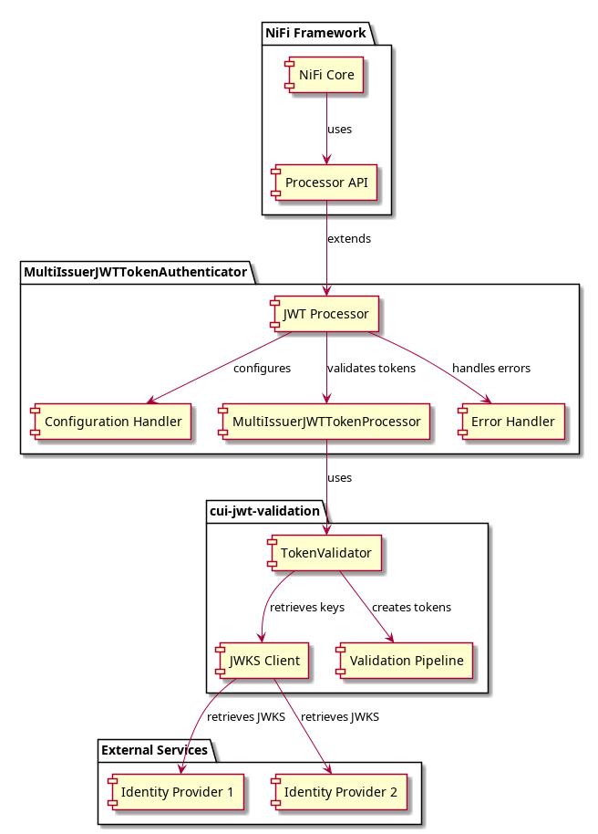

= NiFi Extensions Specification
:toc: left
:toclevels: 3
:toc-title: Table of Contents
:sectnums:
:source-highlighter: highlight.js

== Overview
_See Requirement xref:Requirements.adoc#NIFI-AUTH-1[NIFI-AUTH-1: REST API Support Enhancement]_

This document provides the technical specification for the NiFi Extensions project, which provides two complementary processors for JWT-authenticated REST API handling in Apache NiFi:

* **MultiIssuerJWTTokenAuthenticator** -- validates JWT tokens from FlowFile attributes against multiple identity providers
* **RestApiGatewayProcessor** -- a self-contained REST API gateway with embedded Jetty 12 HTTP server, route-based dispatching, and RFC 9457 error responses

Both processors share JWT validation through a common **JwtIssuerConfigService** Controller Service and leverage the OAuth-Sheriff library for token validation.

For functional requirements, see xref:Requirements.adoc[Requirements Document].

== Document Structure
_See Requirement xref:Requirements.adoc#NIFI-AUTH-13[NIFI-AUTH-13: Documentation Requirements]_

This specification is organized into the following documents:

* xref:specification/technical-components.adoc[Technical Components] - Core implementation details and module architecture
* xref:specification/configuration.adoc[Configuration] - Configuration properties for both processors and Controller Service
* xref:specification/token-validation.adoc[Token Validation] - Token validation implementation
* xref:specification/error-handling.adoc[Error Handling] - Error handling for JWT processor and RFC 9457 gateway errors
* xref:specification/testing.adoc[Testing] - Unit and integration testing
* xref:specification/security.adoc[Security] - Security considerations
* xref:specification/authentication-architecture.adoc[Authentication Architecture] - End-to-end authentication matrix across all service layers
* xref:specification/integration-patterns.adoc[Integration Patterns] - Integration examples for both processors
* xref:specification/internationalization.adoc[Internationalization] - i18n implementation
* xref:specification/configuration-ui.adoc[UI Configuration] - Unified UI configuration details
* xref:specification/configuration-static.adoc[Static Configuration] - Static/container configuration
* xref:specification/jwt-rest-api.adoc[JWT REST API] - REST API endpoints for JWT token verification, JWKS validation, and metrics
* xref:specification/end-to-end-testing.adoc[End-to-End Testing] - E2E testing specification
* xref:specification/integration-testing.adoc[Integration Testing] - Flow pipeline design and Docker-based integration tests
* xref:specification/observability.adoc[Observability] - Security event monitoring and metrics
* xref:LogMessages.adoc[Log Messages] - Log message documentation
* xref:rest-errors/index.adoc[REST API Error Reference] - RFC 9457 error type documentation

[NOTE]
====
Log messages (as defined in xref:LogMessages.adoc[]) are not internationalized. They are always written in English for consistency in logs and monitoring systems.
====

== Libraries and Dependencies

The NiFi Extensions project uses the following key dependencies:

=== Runtime Dependencies

* Apache NiFi 2.x
* OAuth-Sheriff (token validation framework)
* Eclipse Jetty 12 (embedded HTTP server for RestApiGatewayProcessor)
* cui-http (HTTP security pipeline, input sanitization)
* Jakarta JSON Processing (RFC 9457 ProblemDetail serialization)

=== Test Dependencies

* cui-test-mockwebserver-junit5 (for unit testing JWKS endpoints)
* cui-test-keycloak-integration (for integration testing with real tokens)
* JUnit 5 with JUnit Jupiter for modern testing approaches

== Key Technical Features

=== Controller Service Architecture

Both processors share JWT validation through the `JwtIssuerConfigService` Controller Service:

* API interface in `nifi-cuioss-api` (packaged as separate NAR for NiFi 2.x classloader separation)
* Implementation (`StandardJwtIssuerConfigService`) in `nifi-cuioss-common`
* Provides token validation, authentication configuration, and security event counters

=== Multiple Issuer Support
_See Requirement xref:Requirements.adoc#NIFI-AUTH-4[NIFI-AUTH-4: Multiple Issuer Support]_

Both processors support configuring multiple JWT token issuers through the shared Controller Service, each with its own:

* JWKS URL for key retrieval
* Audience validation requirements
* Required scopes
* Accepted algorithms

=== Token Validation
_See Requirement xref:Requirements.adoc#NIFI-AUTH-3[NIFI-AUTH-3: Token Validation Requirements]_

Token validation uses the OAuth-Sheriff library with:

* Signature validation against JWKS keys
* Standard JWT claims validation (exp, nbf, iat, iss, aud)
* Custom scope and role validation
* Support for all standard JWT algorithms including RS256, RS384, RS512, PS256, PS384, PS512, ES256, ES384, and ES512

=== REST API Gateway
_See Requirement xref:Requirements.adoc#NIFI-GATEWAY-1[NIFI-GATEWAY-1: Embedded HTTP Server]_

The RestApiGatewayProcessor provides:

* Embedded Jetty 12 HTTP server with optional SSL/TLS
* Multi-route configuration via dynamic properties (`restapi.<name>.<property>`)
* Per-route JWT authorization (required roles and scopes)
* RFC 9457 Problem Details error responses
* CORS support with configurable allowed origins
* `/metrics` management endpoint (Prometheus and JSON formats)
* Request queue-based back-pressure integration with NiFi flow

=== Static Configuration Support
_See Requirement NIFI-AUTH-7.6: Static Configuration for Container Environments in xref:Requirements.adoc[Requirements Document]_

The Controller Service supports static configuration for container deployments:

* Configuration via properties files (.properties) or YAML (.yml, .yaml)
* Active by default when present
* Environment variable and system property support for configuration paths
* Configuration displayed (read-only) in the UI when static configuration is active

=== Caching and Performance
_See Requirement xref:Requirements.adoc#NIFI-AUTH-9[NIFI-AUTH-9: Performance Requirements]_

The project implements efficient caching for:

* JWKS keys with configurable refresh intervals
* Validated tokens with configurable TTL
* Rejected tokens with negative caching to prevent DDOS

=== Security Features
_See Requirement xref:Requirements.adoc#NIFI-AUTH-8[NIFI-AUTH-8: Security Requirements]_

The project implements strong security practices:

* No storage of private keys
* Secure HTTP communication for JWKS retrieval
* Secure defaults for all configuration properties
* Circuit breaker pattern for JWKS endpoint failures
* Protection against common JWT attacks (algorithm confusion, replay attacks)
* Input sanitization for REST gateway (via cui-http)
* RFC 6750 WWW-Authenticate headers for authentication failures

=== Error Handling
_See Requirement xref:Requirements.adoc#NIFI-AUTH-10[NIFI-AUTH-10: Error Handling Requirements]_

The project provides comprehensive error handling:

* Standardized error codes with consistent messages (JWT processor)
* RFC 9457 Problem Details JSON responses (REST gateway)
* Detailed logging at appropriate levels
* Flow file routing based on error type
* Meaningful flow file attributes for debugging

=== Testing Framework
_See Requirement xref:Requirements.adoc#NIFI-AUTH-14[NIFI-AUTH-14: Unit Testing]_

The project includes:

* Comprehensive unit tests with JUnit 5
* Integration tests using cui-test-keycloak-integration and Docker
* Mock JWKS server tests with cui-test-mockwebserver-junit5
* Playwright E2E tests for UI and WCAG accessibility

== Architecture Overview

The high-level architecture of the NiFi Extensions project:

== Implementation Notes

=== NiFi Compatibility

The project is designed for Apache NiFi 2.x and takes advantage of its improved:

* Processor API features
* Controller Service API with classloader separation
* Expression language support
* Security framework
* Testing utilities

=== OAuth-Sheriff Integration

The project fully leverages the OAuth-Sheriff library's capabilities:

* Standardized token validation
* JWKS key retrieval and caching
* Comprehensive error reporting
* Algorithm support
* Claim validation
* Security event counters
