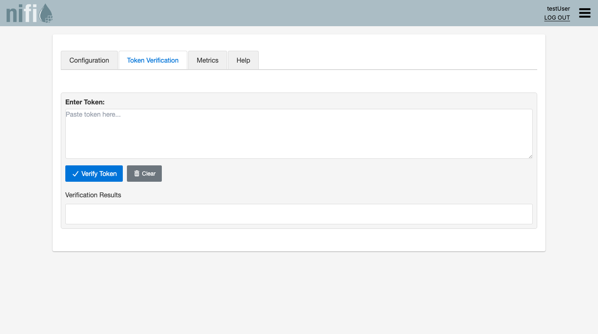

= Step-by-Step Guide: Working with IssuerConfig Properties in NiFi UI

This guide provides detailed instructions for working with the MultiIssuerJWTTokenAuthenticator processor and its IssuerConfig properties in the NiFi UI. The issuer configuration is managed through the `JwtIssuerConfigService` Controller Service, which is shared between both the JWT processor and the RestApiGatewayProcessor.

== Prerequisites

* Docker and Docker Compose installed
* NiFi test environment set up (see <<test-environment-setup,Test Environment Setup>>)

== Test Environment Setup

. Clone the repository (if you haven't already)
. Navigate to the repository root
. Start the test environment:
 `bash
   ./integration-testing/src/main/docker/run-and-deploy.sh
`
. Access NiFi UI at https://localhost:9095/nifi/ (credentials: testUser/drowssap)

== Adding the Processor to the Canvas

. Log in to the NiFi UI using the credentials: testUser/drowssap
. Drag and drop a new processor onto the canvas:
* Click the processor icon in the toolbar
* Search for "MultiIssuerJWTTokenAuthenticator"
* Drag it onto the canvas
. Right-click on the processor and select "Configure"

== Configuring the Processor

=== Basic Configuration

. In the "Settings" tab:
* Set a name for the processor (optional)
* Set scheduling strategy (e.g., "Timer driven")
* Set run schedule (e.g., "1 sec")
. In the "Properties" tab:
* Configure basic properties:
** JWT Issuer Config Service: reference to a configured JwtIssuerConfigService Controller Service
** Token Attribute: jwt.token (default)
** Require Valid Token: true (default)

=== Configuring Issuer Properties

There are two ways to configure issuer properties:

==== Method 1: Using the Custom Issuer Configuration Tab

. In the processor configuration dialog, look for the "Configuration" tab in the custom UI (it appears as the first tab alongside "Token Verification", "Metrics", and "Help")
. Click on it to access the issuer configuration interface
. The interface should display:
* A list of existing issuer configurations (if any)
* An "Add Issuer" button to create new configurations
image::ui-configuration-tab.png[Issuer Configuration Tab]

. To add a new issuer:
* Click the "Add Issuer" button
* Enter an issuer name (e.g., "keycloak")
* Fill in the required fields:
** Issuer URI: The URI of the token issuer (must match the "iss" claim in the JWT)
** Example: `http://keycloak:8080/realms/oauth_integration_tests`
** JWKS URL: The URL of the JWKS endpoint
** Example: `http://keycloak:8080/realms/oauth_integration_tests/protocol/openid-connect/certs`
** Audience (optional): The expected audience claim value
** Client ID (optional): The client ID for token validation
* Click "Save Issuer"

==== Method 2: Using Dynamic Properties (Manual Configuration)

If the custom tab is not visible or not functioning properly, you can configure issuers using dynamic properties:

. In the "Properties" tab, click the "+" button to add a new property
. Add properties in the format `issuer.<issuer-name>.<property-key>`:
* `issuer.keycloak.issuer`: The URI of the token issuer
** Example: `http://keycloak:8080/realms/oauth_integration_tests`
* `issuer.keycloak.jwks-url`: The URL of the JWKS endpoint
** Example: `http://keycloak:8080/realms/oauth_integration_tests/protocol/openid-connect/certs`
* `issuer.keycloak.audience` (optional): The expected audience claim value
* `issuer.keycloak.client-id` (optional): The client ID for token validation
. Click "Apply" to save the properties

== Testing the Configuration

. Apply the configuration changes
. Start the processor
. Obtain a test token from Keycloak:
 `bash
   curl -X POST \
 http://localhost:9080/realms/oauth_integration_tests/protocol/openid-connect/token \
 -H 'Content-Type: application/x-www-form-urlencoded' \
 -d 'grant_type=password&client_id=test_client&client_secret=yTKslWLtf4giJcWCaoVJ20H8sy6STexM&username=testUser&password=drowssap'
`
. Create a test flow to send the token to the processor:
* Add a GenerateFlowFile processor
* Connect it to the MultiIssuerJWTTokenAuthenticator
* Configure GenerateFlowFile to add the token as an attribute:
** Property name: `jwt.token`
** Property value: the access_token value from the Keycloak response
. Start the flow and observe the results

== Troubleshooting

=== Custom UI Tab Not Visible

If the "Issuer Configuration" tab is not visible:

. Check browser console for errors (F12 &gt; Console)
. Verify that the custom UI components are loaded:
* Look for messages like "[DEBUG_LOG] Loading CSS for custom UI components"
* Check for errors related to loading JavaScript or CSS files
. Try refreshing the page or using a different browser
. Fall back to using dynamic properties (Method 2) for configuration

=== Configuration Not Applied

If the issuer configuration is not being applied:

. Check the NiFi logs for errors:
 `bash
   docker compose -f integration-testing/src/main/docker/docker-compose.yml logs nifi
`
. Verify that the processor is properly configured:
* Check that the JWKS URL is correct and accessible
* Ensure the issuer URI matches the "iss" claim in the JWT
. Try restarting the processor

=== Token Validation Failures

If tokens are not being validated correctly:

. Check the token claims using the "Token Verification" tab (if available)
. Verify that the token is not expired
. Ensure the issuer URI in the configuration matches the "iss" claim in the token
. Check that the JWKS URL is accessible and returns valid keys
. Verify that the token's signing algorithm is in the list of allowed algorithms

== Advanced Configuration

=== Multiple Issuers

You can configure multiple issuers by repeating the steps above with different issuer names:

. Using the custom tab:
* Click "Add Issuer" for each issuer
* Use different names for each issuer (e.g., "keycloak", "auth0")
. Using dynamic properties:
* Add properties with different issuer names:
** `issuer.keycloak.jwks-url`: For Keycloak
** `issuer.auth0.jwks-url`: For Auth0

=== External Configuration

The processor also supports loading configuration from external sources:

. Environment variables
. Configuration files

Refer to the link:QuickStart.adoc#_static_configuration_files[Static Configuration Files] and link:QuickStart.adoc#_environment_variables[Environment Variables] sections in the Quick Start Guide for details.

=== Using with RestApiGatewayProcessor

The same `JwtIssuerConfigService` Controller Service configured here is also used by the RestApiGatewayProcessor. If you configure issuers for the JWT processor, the gateway can reuse the same Controller Service instance. The gateway also provides its own **Issuer Configuration** tab for managing issuers directly from the gateway UI. See the link:QuickStart.adoc#_restapigateway_quick_start[RestApiGateway Quick Start] for gateway-specific configuration.