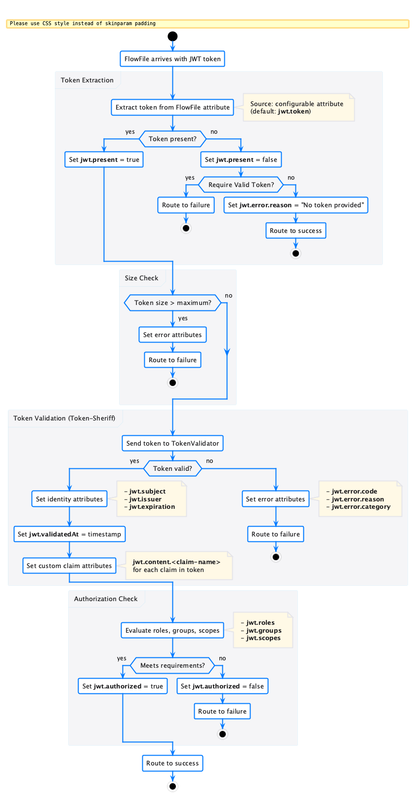

= MultiIssuerJWTTokenAuthenticator Guide
:toc: left
:toclevels: 2
:toc-title: Table of Contents
:sectnums:
:source-highlighter: highlight.js

The `MultiIssuerJWTTokenAuthenticator` is a NiFi processor for FlowFile-based JWT validation.
It reads a JWT from a FlowFile attribute, validates it against one or more identity providers via the shared `JwtIssuerConfigService` Controller Service, and writes token claims back as FlowFile attributes.

== Use Case

NiFi flows that consume REST APIs or process webhook payloads often receive JWT-authenticated requests.
The `MultiIssuerJWTTokenAuthenticator` drops into any flow as a single node -- no multi-processor chaining required.

Typical scenarios:

* Validate incoming webhook JWTs before processing the payload
* Extract user identity and roles from a token for downstream routing
* Gate access in flows that front multiple identity providers (Keycloak, Entra ID, Auth0)

== How It Works

The processor reads a JWT from a configurable FlowFile attribute (default: `Authorization` header), validates signature, expiry, issuer, and optionally required roles, then routes the FlowFile to `success` or `auth-failed`.
On success, token claims are written as `jwt.*` FlowFile attributes (subject, issuer, roles, expiry, etc.).

== Integration Test Flow

The project includes a complete NiFi flow definition that demonstrates the processor with a real Keycloak identity provider.
The flow is defined in link:../../integration-testing/src/main/docker/nifi/conf/flow.json[flow.json] and implements a JWT authentication gateway:

* **HandleHttpRequest** accepts incoming HTTP on port 7777
* **MultiIssuerJWTTokenAuthenticator** validates the JWT and checks roles
* Authorized requests (HTTP 200) and rejected requests (HTTP 401) are routed through separate paths
* Response bodies contain the `jwt.*` attributes as JSON for inspection

The authenticator is configured with one Keycloak issuer:

[source]
----
issuer.keycloak.jwks-url = http://keycloak:8080/realms/oauth_integration_tests/protocol/openid-connect/certs
issuer.keycloak.issuer    = http://keycloak:8080/realms/oauth_integration_tests
issuer.keycloak.required-roles = read
----

See link:../../integration-testing/doc/flow-pipeline.adoc[Flow Pipeline Design] for the complete pipeline architecture and test scenarios.

== Running the Integration Tests

[source,bash]
----
./mvnw verify -Pintegration-tests
----

Or use the link:../../README.adoc#_sandbox[Sandbox] to explore the flow interactively.

== Further Reading

* link:QuickStart.adoc[Quick Start Guide] -- processor properties, issuer configuration, relationships, output attributes, troubleshooting
* link:../../doc/specification/token-validation.adoc[Token Validation Specification]
