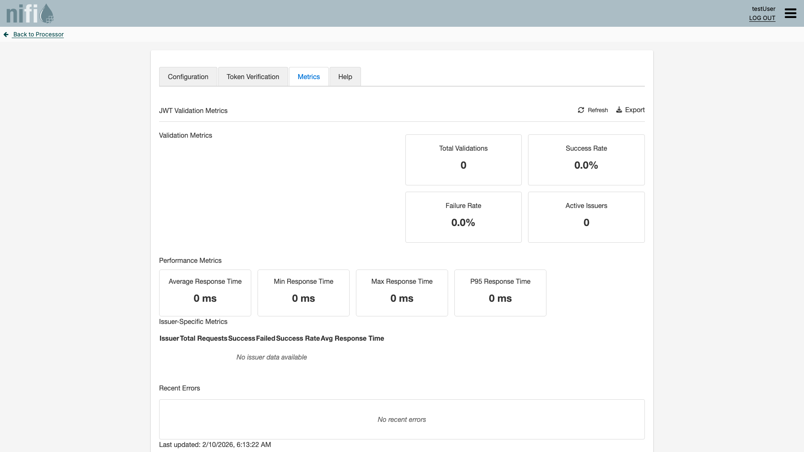

= Quick Start Guide
:toc: left
:toclevels: 2
:toc-title: Table of Contents
:sectnums:
:source-highlighter: highlight.js

Get the MultiIssuerJWTTokenAuthenticator processor running in under 5 minutes.

== Prerequisites

* Apache NiFi 2.6.0+ running and accessible
* The `nifi-cuioss-nar-<version>.nar` deployed to `$NIFI_HOME/extensions/` (see link:../../README.adoc#installation[Installation])
* A JWKS endpoint URL from your identity provider (e.g. Keycloak, Entra ID, Auth0)

== Step 1: Add the Processor

. Open the NiFi UI.
. Drag a new processor onto the canvas.
. Search for **MultiIssuerJWTTokenAuthenticator** and select it.

== Step 2: Configure the Processor

. Right-click the processor and select **Configure**.
. In the **Properties** tab, review the defaults -- they work for the most common case (see <<processor-properties>> for all options).
. Switch to the **Configuration** tab in the custom UI to configure issuers visually:

image::ui-configuration-tab.png[Configuration Tab - Issuer Configuration]

. Alternatively, add a dynamic property for your identity provider by clicking the **+** button:
+
[cols="1,2"]
|===
|Property Name |Value

|`issuer.1.jwks-url`
|Your JWKS endpoint URL, e.g. `\https://auth.example.com/.well-known/jwks.json`
|===

. _(Optional)_ Add audience validation:
+
[cols="1,2"]
|===
|Property Name |Value

|`issuer.1.audience`
|Your expected audience claim, e.g. `api://my-service`
|===

. Click **Apply**.

== Step 3: Connect Relationships

Connect all three relationships to downstream processors:

[cols="1,3"]
|===
|Relationship |Route to

|`success`
|Your normal processing flow (token is valid)

|`authentication-failed`
|Error handling for rejected tokens (expired, wrong issuer, bad signature)

|`failure`
|Error handling for extraction failures (no token found, processing error)
|===

== Step 4: Start the Processor

. Right-click the processor and select **Start**.
. Send a FlowFile with an `Authorization: Bearer <token>` header through the processor.
. Verify that valid tokens route to `success` and invalid tokens route to `authentication-failed`.

[#processor-properties]
== Processor Properties

[cols="2,1,1,4"]
|===
|Property |Default |Required |Description

|Token Location
|`AUTHORIZATION_HEADER`
|Yes
|Where to extract the JWT. Values: `AUTHORIZATION_HEADER`, `CUSTOM_HEADER`, `FLOW_FILE_CONTENT`

|Token Header
|`Authorization`
|No
|Header name when using `AUTHORIZATION_HEADER`

|Custom Header Name
|`X-Authorization`
|No
|Header name when using `CUSTOM_HEADER`

|Bearer Token Prefix
|`Bearer`
|No
|Prefix stripped before token parsing

|Require Valid Token
|`true`
|Yes
|When `true`, missing or invalid tokens route to `authentication-failed`

|JWKS Refresh Interval
|`3600`
|Yes
|Seconds between JWKS key refreshes

|JWKS Connection Timeout
|`10`
|Yes
|Seconds before a JWKS endpoint request times out

|Maximum Token Size
|`16384`
|Yes
|Maximum JWT size in bytes (rejects oversized tokens)

|Allowed Algorithms
|Secure defaults
|No
|Comma-separated list of permitted signing algorithms. Defaults to RS256, RS384, RS512, ES256, ES384, ES512, PS256, PS384, PS512. The `none` algorithm and weak HMAC algorithms are always blocked.

|Require HTTPS for JWKS URLs
|`true`
|Yes
|Enforces HTTPS for JWKS endpoint URLs. Disable only for development.

|JWKS Source Type
|`url`
|Yes
|How JWKS keys are loaded. Values: `url` (HTTP endpoint), `file` (local file), `memory` (inline content)
|===

== Issuer Configuration (Dynamic Properties)

Each identity provider is configured through dynamic properties with the prefix `issuer.<N>.`:

[cols="2,3,1"]
|===
|Dynamic Property |Description |Example

|`issuer.<N>.jwks-url`
|JWKS endpoint URL, file path, or inline key content (depends on JWKS Source Type)
|`\https://auth.example.com/.well-known/jwks.json`

|`issuer.<N>.enabled`
|Enable or disable this issuer without removing the configuration
|`true`

|`issuer.<N>.audience`
|Required `aud` claim for tokens from this issuer
|`api://my-service`

|`issuer.<N>.scopes`
|Comma-separated scopes required for authorization
|`read,write`

|`issuer.<N>.roles`
|Comma-separated roles required for authorization
|`admin,user`
|===

=== Adding Multiple Issuers

To accept tokens from more than one identity provider, add additional dynamic properties:

[source]
----
issuer.1.jwks-url  = https://keycloak.example.com/realms/myapp/protocol/openid-connect/certs
issuer.1.audience  = api://my-service

issuer.2.jwks-url  = https://login.microsoftonline.com/{tenant}/discovery/v2.0/keys
issuer.2.audience  = api://my-service

issuer.3.jwks-url  = https://your-domain.auth0.com/.well-known/jwks.json
issuer.3.audience  = https://api.example.com
----

Each issuer can have its own audience, scopes, and roles. Issuers can be individually enabled/disabled with `issuer.<N>.enabled`.

== Output FlowFile Attributes

On successful validation the processor sets these attributes on the FlowFile:

[cols="2,3"]
|===
|Attribute |Description

|`jwt.present`
|`true` if a JWT was found in the request

|`jwt.subject`
|The `sub` claim

|`jwt.issuer`
|The `iss` claim

|`jwt.expiration`
|The `exp` claim

|`jwt.roles`
|Comma-separated roles from the token

|`jwt.scopes`
|Comma-separated scopes from the token

|`jwt.authorized`
|`true` if scope/role authorization passed

|`jwt.content.<claim>`
|Individual token claims (prefixed)

|`jwt.error.code`
|Error code on validation failure

|`jwt.error.reason`
|Human-readable error description
|===

== Static Configuration Files

For container or automated deployments, place a configuration file in one of these locations (checked in order):

. Path from JVM system property `jwt.config.path`
. Path from environment variable `JWT_CONFIG_PATH`
. `$NIFI_HOME/conf/jwt-validation.properties` or `$NIFI_HOME/conf/jwt-validation.yml`

.Example: `jwt-validation.properties`
[source,properties]
----
jwt.validation.token.location=AUTHORIZATION_HEADER
jwt.validation.bearer.token.prefix=Bearer
jwt.validation.require.valid.token=true
jwt.validation.jwks.refresh.interval=3600

jwt.validation.issuer.1.jwksUrl=https://auth.example.com/.well-known/jwks.json
jwt.validation.issuer.1.audience=api://my-service
jwt.validation.issuer.1.enabled=true

jwt.validation.issuer.2.jwksUrl=https://auth2.example.com/.well-known/jwks.json
jwt.validation.issuer.2.audience=api://my-service
jwt.validation.issuer.2.enabled=true
jwt.validation.issuer.2.scopes=read,write
----

.Example: `jwt-validation.yml`
[source,yaml]
----
jwt:
  validation:
    issuers:
      - name: "Primary IdP"
        enabled: true
        jwksUrl: "https://auth.example.com/.well-known/jwks.json"
        audience: "api://my-service"
      - name: "Partner IdP"
        enabled: true
        jwksUrl: "https://partner-auth.example.com/.well-known/jwks.json"
        audience: "api://my-service"
        scopes: "read,write"
        roles: "partner"
----

Static configuration takes precedence over UI settings and is displayed as read-only in the UI. The processor monitors the file for changes and reloads automatically.

== Environment Variables

For Kubernetes and Docker deployments, core settings can also be provided through environment variables:

[cols="2,1,3"]
|===
|Variable |Type |Description

|`JWT_TOKEN_LOCATION`
|String
|`AUTHORIZATION_HEADER`, `CUSTOM_HEADER`, or `FLOW_FILE_CONTENT`

|`JWT_TOKEN_HEADER_NAME`
|String
|Header name when Token Location is `AUTHORIZATION_HEADER`

|`JWT_CUSTOM_HEADER_NAME`
|String
|Header name when Token Location is `CUSTOM_HEADER`

|`JWT_JWKS_REFRESH_INTERVAL`
|Duration
|JWKS cache refresh (e.g. `30 minutes`, `1 hour`)

|`JWT_REQUIRE_VALID_TOKEN`
|Boolean
|Require valid token for success routing

|`JWT_ISSUER_{NAME}_JWKS_URL`
|URL
|JWKS endpoint for an issuer. Replace `{NAME}` with a unique identifier (e.g. `KEYCLOAK`).

|`JWT_ISSUER_{NAME}_PUBLIC_KEY`
|String
|PEM-encoded public key for an issuer. Replace `{NAME}` with a unique identifier.
|===

.Kubernetes Deployment example using environment variables
[source,yaml]
----
apiVersion: apps/v1
kind: Deployment
metadata:
  name: nifi-deployment
spec:
  template:
    spec:
      containers:
      - name: nifi
        image: apache/nifi:2.6.0
        env:
        - name: JWT_TOKEN_LOCATION
          value: "AUTHORIZATION_HEADER"
        - name: JWT_ISSUER_KEYCLOAK_JWKS_URL
          value: "https://keycloak.internal/realms/myapp/protocol/openid-connect/certs"
----

== Verifying with the Custom UI

The processor includes a custom web UI with additional tabs beyond the standard NiFi properties dialog:

* **Token Verification** -- paste a JWT to test it against the current configuration

image::ui-token-verification-tab.png[Token Verification Tab]

* **Metrics** -- view validation statistics (success/failure counts, response times)

These tabs appear automatically in the processor configuration dialog.

== Next Steps

* link:IssuerConfigPropertiesGuide.adoc[Detailed issuer configuration walkthrough] -- step-by-step guide with test environment setup and troubleshooting
* link:../../doc/specification/configuration.adoc[Configuration specification] -- complete configuration reference
* link:../../doc/specification/security.adoc[Security specification] -- algorithm restrictions, SSRF protection, security headers
