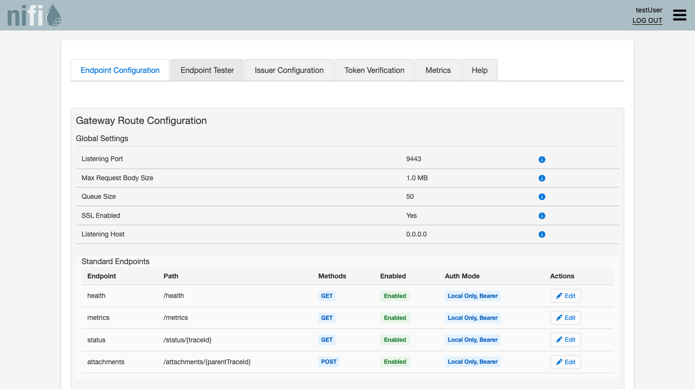
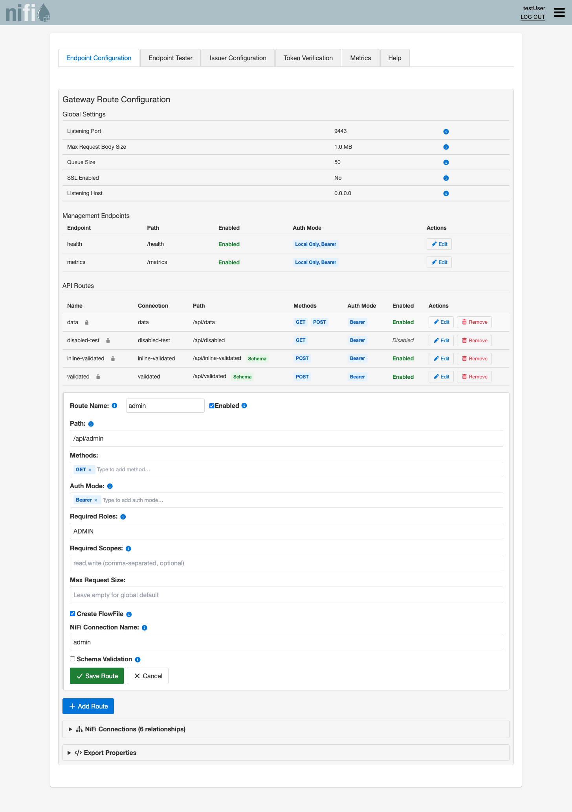
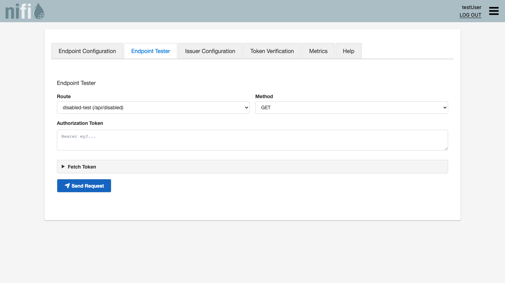
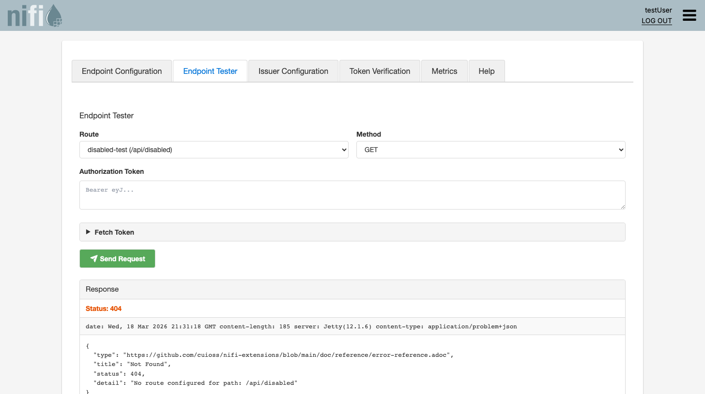
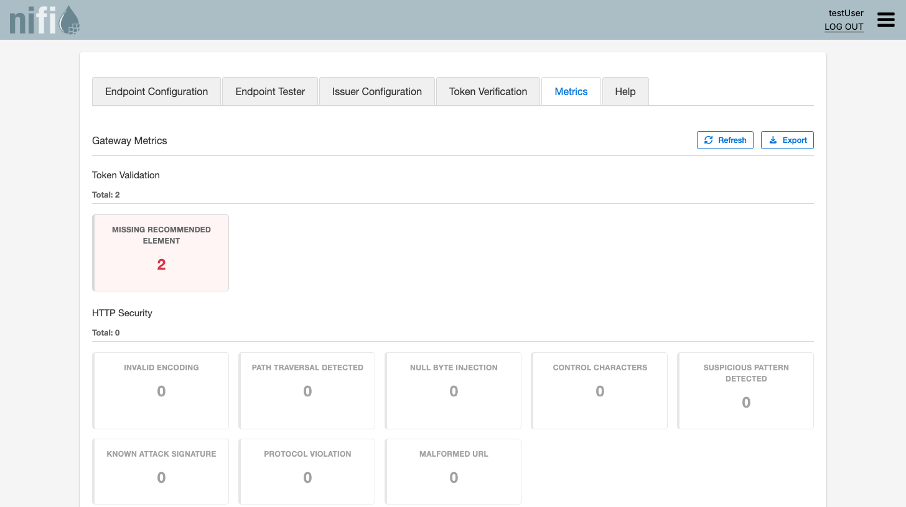
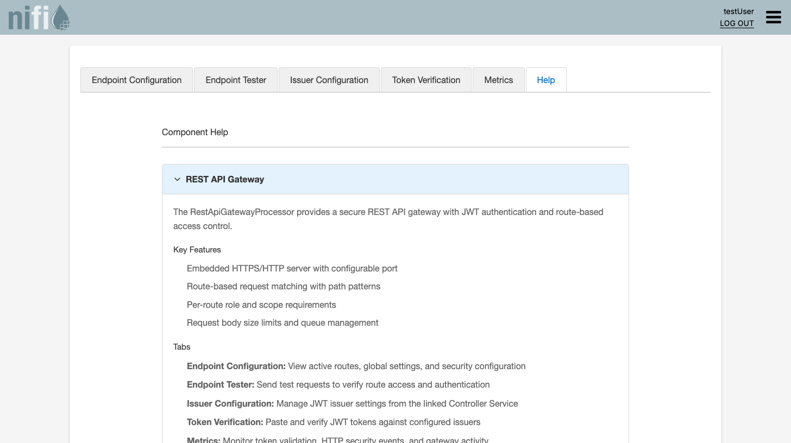

= Quick Start Guide
:toc: left
:toclevels: 2
:toc-title: Table of Contents
:sectnums:
:source-highlighter: highlight.js

Get the NiFi Extensions processors running in under 5 minutes. This guide covers both the **MultiIssuerJWTTokenAuthenticator** (FlowFile-based JWT validation) and the **RestApiGatewayProcessor** (self-contained REST API gateway).

== Prerequisites

* Apache NiFi running and accessible
* Both `nifi-cuioss-api-nar-<version>.nar` and `nifi-cuioss-nar-<version>.nar` deployed to `$NIFI_HOME/extensions/` (see link:../../README.adoc#installation[Installation])
* A JWKS endpoint URL from your identity provider (e.g. Keycloak, Entra ID, Auth0)

== Step 1: Add the Processor

. Open the NiFi UI.
. Drag a new processor onto the canvas.
. Search for **MultiIssuerJWTTokenAuthenticator** and select it.

== Step 2: Configure the Processor

. Right-click the processor and select **Configure**.
. In the **Properties** tab, review the defaults -- they work for the most common case (see <<processor-properties>> for all options).
. Switch to the **Configuration** tab in the custom UI to configure issuers visually:

image::ui-configuration-tab.png[Configuration Tab - Issuer Configuration]

. Alternatively, add a dynamic property for your identity provider by clicking the **+** button:
+
[cols="1,2"]
|===
|Property Name |Value

|`issuer.1.jwks-url`
|Your JWKS endpoint URL, e.g. `\https://auth.example.com/.well-known/jwks.json`
|===

. _(Optional)_ Add audience validation:
+
[cols="1,2"]
|===
|Property Name |Value

|`issuer.1.audience`
|Your expected audience claim, e.g. `api://my-service`
|===

. Click **Apply**.

== Step 3: Connect Relationships

Connect both relationships to downstream processors:

[cols="1,3"]
|===
|Relationship |Route to

|`success`
|Your normal processing flow (token is valid)

|`authentication-failed`
|Error handling for rejected tokens (expired, wrong issuer, bad signature, missing token)
|===

== Step 4: Start the Processor

. Right-click the processor and select **Start**.
. Send a FlowFile with a `jwt.token` attribute containing the raw JWT token.
. Verify that valid tokens route to `success` and invalid tokens route to `authentication-failed`.

[#processor-properties]
== Processor Properties

[cols="2,1,1,4"]
|===
|Property |Default |Required |Description

|JWT Issuer Config Service
|--
|Yes
|Reference to the `JwtIssuerConfigService` Controller Service that manages issuer configuration and token validation

|Token Attribute
|`jwt.token`
|Yes
|The FlowFile attribute name containing the raw JWT token

|Require Valid Token
|`true`
|Yes
|When `true`, missing or invalid tokens route to `authentication-failed`

|Required Roles
|--
|No
|Comma-separated list of roles the token must contain for authorization

|Required Scopes
|--
|No
|Comma-separated list of scopes the token must contain for authorization
|===

== Controller Service Properties

The `JwtIssuerConfigService` manages issuer configuration, JWKS key management, and token validation settings:

[cols="2,1,1,4"]
|===
|Property |Default |Required |Description

|JWKS Refresh Interval
|`3600`
|Yes
|Seconds between JWKS key refreshes

|JWKS Connection Timeout
|`10`
|Yes
|Seconds before a JWKS endpoint request times out

|Maximum Token Size
|`16384`
|Yes
|Maximum JWT size in bytes (rejects oversized tokens)

|Allowed Algorithms
|Secure defaults
|No
|Comma-separated list of permitted signing algorithms. Defaults to RS256, RS384, RS512, ES256, ES384, ES512, PS256, PS384, PS512. The `none` algorithm and weak HMAC algorithms are always blocked.

|Require HTTPS for JWKS URLs
|`true`
|Yes
|Enforces HTTPS for JWKS endpoint URLs. Disable only for development.
|===

== Issuer Configuration (CS Dynamic Properties)

Each identity provider is configured as dynamic properties on the `JwtIssuerConfigService` Controller Service with the prefix `issuer.<N>.`:

[cols="2,3,1"]
|===
|Dynamic Property |Description |Example

|`issuer.<N>.jwks-url`
|JWKS endpoint URL, file path, or inline key content (depends on JWKS Source Type)
|`\https://auth.example.com/.well-known/jwks.json`

|`issuer.<N>.enabled`
|Enable or disable this issuer without removing the configuration
|`true`

|`issuer.<N>.audience`
|Required `aud` claim for tokens from this issuer
|`api://my-service`

|`issuer.<N>.scopes`
|Comma-separated scopes required for authorization
|`read,write`

|`issuer.<N>.roles`
|Comma-separated roles required for authorization
|`admin,user`
|===

=== Adding Multiple Issuers

To accept tokens from more than one identity provider, add additional dynamic properties:

[source]
----
issuer.1.jwks-url  = https://keycloak.example.com/realms/myapp/protocol/openid-connect/certs
issuer.1.audience  = api://my-service

issuer.2.jwks-url  = https://login.microsoftonline.com/{tenant}/discovery/v2.0/keys
issuer.2.audience  = api://my-service

issuer.3.jwks-url  = https://your-domain.auth0.com/.well-known/jwks.json
issuer.3.audience  = https://api.example.com
----

Each issuer can have its own audience, scopes, and roles. Issuers can be individually enabled/disabled with `issuer.<N>.enabled`.

== Output FlowFile Attributes

On successful validation the processor sets these attributes on the FlowFile:

[cols="2,3"]
|===
|Attribute |Description

|`jwt.present`
|`true` if a JWT was found in the request

|`jwt.subject`
|The `sub` claim

|`jwt.issuer`
|The `iss` claim

|`jwt.expiration`
|The `exp` claim

|`jwt.roles`
|Comma-separated roles from the token

|`jwt.scopes`
|Comma-separated scopes from the token

|`jwt.authorized`
|`true` if scope/role authorization passed

|`jwt.content.<claim>`
|Individual token claims (prefixed)

|`jwt.error.code`
|Error code on validation failure

|`jwt.error.reason`
|Human-readable error description
|===

== Static Configuration Files

For container or automated deployments, the Controller Service can load configuration from a file in one of these locations (checked in order):

. Path from JVM system property `jwt.config.path`
. Path from environment variable `JWT_CONFIG_PATH`
. `$NIFI_HOME/conf/jwt-validation.properties` or `$NIFI_HOME/conf/jwt-validation.yml`

.Example: `jwt-validation.properties`
[source,properties]
----
jwt.validation.require.valid.token=true
jwt.validation.jwks.refresh.interval=3600

jwt.validation.issuer.1.jwksUrl=https://auth.example.com/.well-known/jwks.json
jwt.validation.issuer.1.audience=api://my-service
jwt.validation.issuer.1.enabled=true

jwt.validation.issuer.2.jwksUrl=https://auth2.example.com/.well-known/jwks.json
jwt.validation.issuer.2.audience=api://my-service
jwt.validation.issuer.2.enabled=true
----

.Example: `jwt-validation.yml`
[source,yaml]
----
jwt:
  validation:
    issuers:
      - name: "Primary IdP"
        enabled: true
        jwksUrl: "https://auth.example.com/.well-known/jwks.json"
        audience: "api://my-service"
      - name: "Partner IdP"
        enabled: true
        jwksUrl: "https://partner-auth.example.com/.well-known/jwks.json"
        audience: "api://my-service"
        scopes: "read,write"
        roles: "partner"
----

Static configuration takes precedence over UI settings and is displayed as read-only in the UI. The processor monitors the file for changes and reloads automatically.

== Environment Variables

For Kubernetes and Docker deployments, core settings can also be provided through environment variables:

[cols="2,1,3"]
|===
|Variable |Type |Description

|`JWT_JWKS_REFRESH_INTERVAL`
|Duration
|JWKS cache refresh (e.g. `30 minutes`, `1 hour`)

|`JWT_REQUIRE_VALID_TOKEN`
|Boolean
|Require valid token for success routing

|`JWT_ISSUER_{NAME}_JWKS_URL`
|URL
|JWKS endpoint for an issuer. Replace `{NAME}` with a unique identifier (e.g. `KEYCLOAK`).

|`JWT_ISSUER_{NAME}_PUBLIC_KEY`
|String
|PEM-encoded public key for an issuer. Replace `{NAME}` with a unique identifier.
|===

.Kubernetes Deployment example using environment variables
[source,yaml]
----
apiVersion: apps/v1
kind: Deployment
metadata:
  name: nifi-deployment
spec:
  template:
    spec:
      containers:
      - name: nifi
        image: apache/nifi:2.7.2
        env:
        - name: JWT_ISSUER_KEYCLOAK_JWKS_URL
          value: "https://keycloak.internal/realms/myapp/protocol/openid-connect/certs"
----

== Verifying with the Custom UI

The JWT processor includes a custom web UI with additional tabs beyond the standard NiFi properties dialog:

* **Configuration** -- visually manage issuer configurations (see <<Step 2>>)
* **Token Verification** -- paste a JWT to test it against the current configuration
* **Help** -- built-in documentation and troubleshooting

image::ui-token-verification-tab.png[Token Verification Tab]

NOTE: The **Metrics** tab is available only for the RestApiGatewayProcessor. For the JWT processor, it displays a notice directing you to use the gateway for metrics.

== RestApiGateway Quick Start

The `RestApiGatewayProcessor` provides a self-contained REST API gateway with embedded HTTP server, JWT authentication, and route-based access control. It has its own custom UI with four tabs: **Endpoint Configuration**, **Endpoint Tester**, **Metrics**, and **Help**.

=== Step 1: Add the Processor

. Open the NiFi UI.
. Drag a new processor onto the canvas.
. Search for **RestApiGatewayProcessor** and select it.

=== Step 2: Configure the Controller Service

The gateway uses the same `JwtIssuerConfigService` Controller Service as the JWT processor. If you already have one configured, you can reuse it. Otherwise, create one as described in the JWT Quick Start above.

=== Step 3: Set Gateway Properties

In the processor properties tab:

[cols="1,2"]
|===
|Property |Value

|Listening Port
|`9443` (or your preferred port)

|JWT Issuer Config Service
|Select your configured CS

|Max Request Body Size
|`1048576` (1 MB default)

|Request Queue Size
|`50` (default)
|===

=== Step 4: Configure Routes via the Custom UI

The gateway provides a visual route editor in its custom UI. Right-click the processor and select **Configure** to open it.

The **Endpoint Configuration** tab shows global settings (read-only, derived from processor properties) and a route table with CRUD controls:

To add a route, click **+ Add Route** and fill in the form:

Each route has the following fields:

[cols="1,3"]
|===
|Field |Description

|Route Name
|Unique identifier for the route (e.g. `users`, `admin`)

|Enabled
|Checkbox to enable/disable the route without removing it

|Path
|URL path pattern (e.g. `/api/users`)

|Methods
|Comma-separated HTTP methods (e.g. `GET,POST`)

|Required Roles
|Comma-separated roles required for access (optional)

|Required Scopes
|Comma-separated scopes required for access (optional)

|JSON Schema
|Optional JSON Schema for request body validation (inline or file-based)
|===

Routes with a JSON Schema configured display a green **Schema** badge in the route table.

TIP: You can also configure routes via dynamic properties on the processor (useful for automated deployments). Click the **Export Properties** panel at the bottom of the Endpoint Configuration tab to see the equivalent `restapi.*` properties.

=== Step 5: Connect Relationships

Each route creates a named relationship. Connect them to downstream processors:

* `users` -> your user-handling processor
* `admin` -> your admin-handling processor
* `failure` -> error handling

=== Step 6: Start and Test

Start the processor. The gateway listens on the configured port.

==== Using the Endpoint Tester

The **Endpoint Tester** tab in the custom UI lets you send test requests directly from the browser:

. Select a route and HTTP method from the dropdowns.
. Paste an authorization token (or leave empty to test unauthenticated access).
. Click **Send Request** to see the response status, headers, and body.

==== Using curl

[source,bash]
----
# Get a token from your identity provider
TOKEN=$(curl -s -X POST https://your-idp/token -d 'grant_type=client_credentials' | jq -r '.access_token')

# Send a request to the gateway
curl -H "Authorization: Bearer $TOKEN" https://localhost:9443/api/users
----

A successful request returns HTTP 202 (Accepted) and creates a FlowFile on the matching route relationship.

=== Gateway Metrics

The **Metrics** tab provides real-time monitoring of the gateway with three sections:

* **Token Validation** -- JWT validation success/failure counts
* **HTTP Security** -- security-related HTTP events
* **Gateway Events** -- overall gateway activity

Use the **Refresh** button to update metrics and **Export** to download them as JSON.

=== Gateway Help

The **Help** tab provides built-in documentation covering key features, tab descriptions, and troubleshooting tips.

== Next Steps

* link:IssuerConfigPropertiesGuide.adoc[Detailed issuer configuration walkthrough] -- step-by-step guide with test environment setup and troubleshooting
* link:../../doc/specification/configuration.adoc[Configuration specification] -- complete configuration reference
* link:../../doc/specification/security.adoc[Security specification] -- algorithm restrictions, SSRF protection, security headers
* link:../../doc/rest-errors/index.adoc[REST API error reference] -- RFC 9457 error types returned by the gateway
