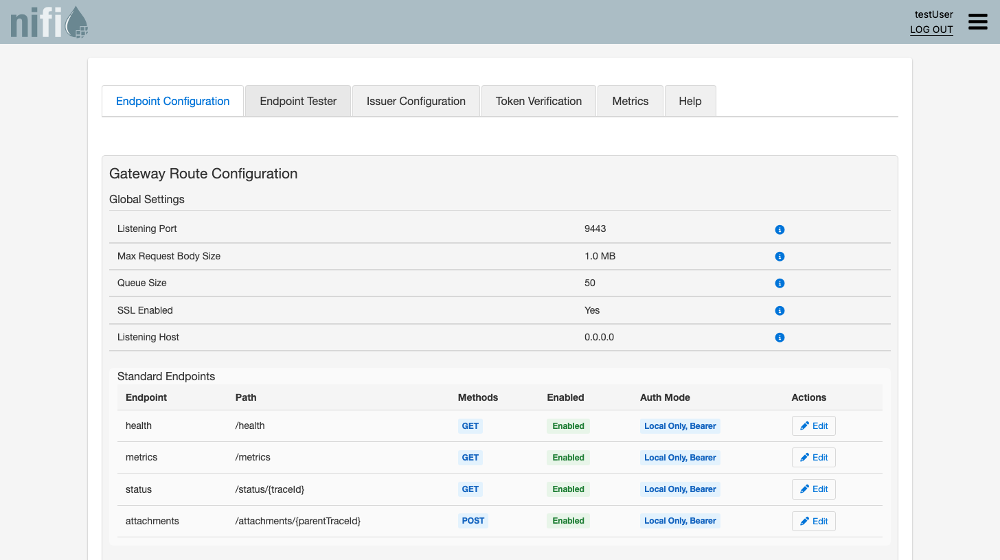
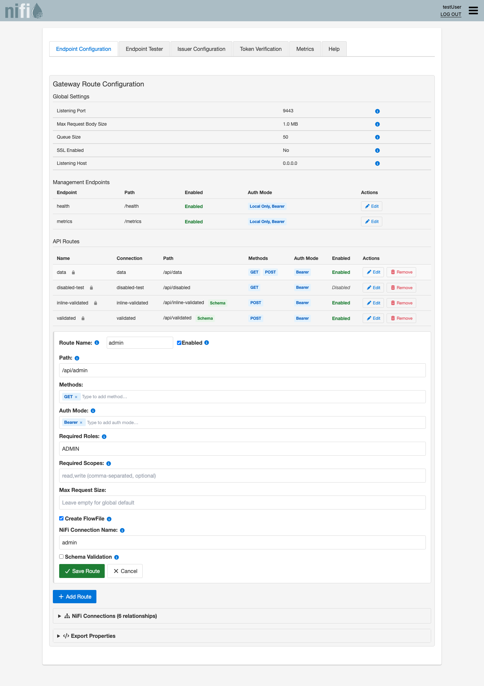
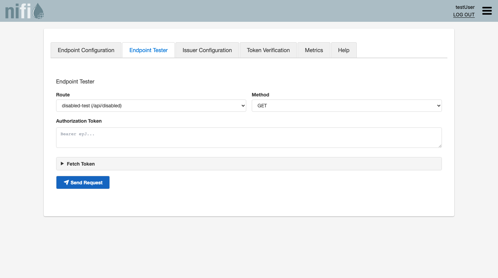
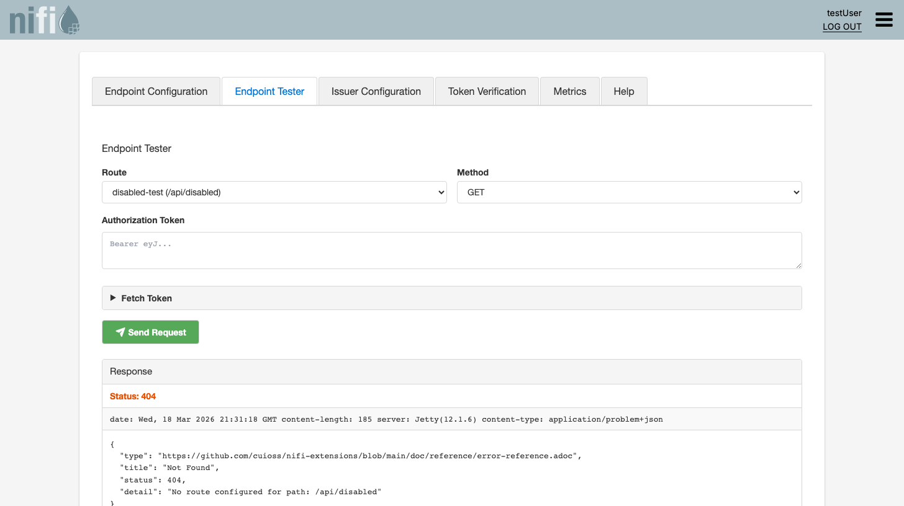
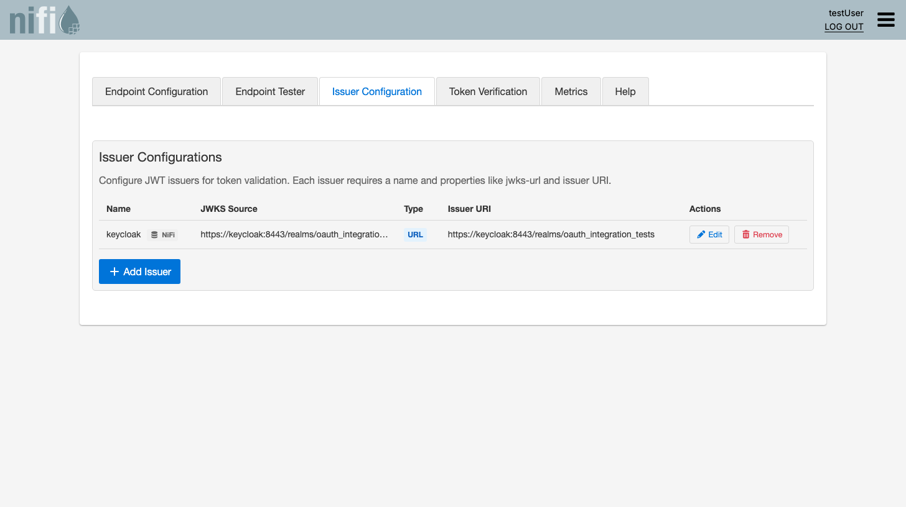
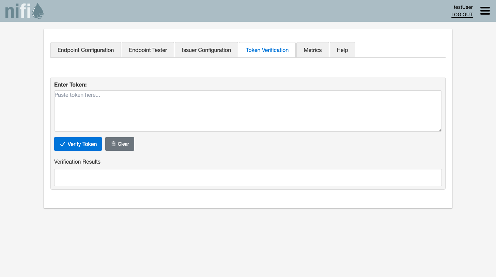
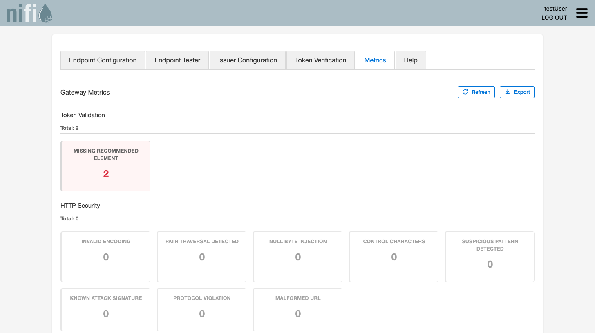
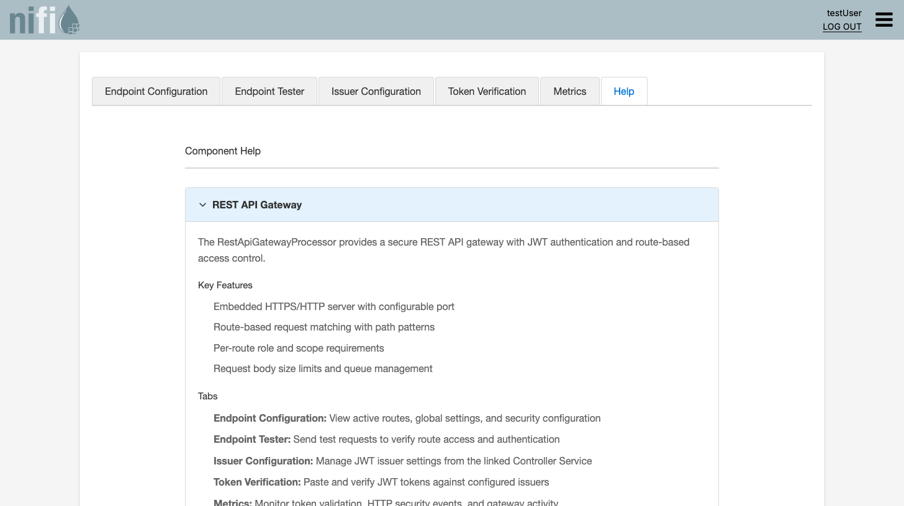

= Quick Start Guide
:toc: left
:toclevels: 2
:toc-title: Table of Contents
:sectnums:
:source-highlighter: highlight.js

Get the RestApiGatewayProcessor running in under 5 minutes. For the MultiIssuerJWTTokenAuthenticator (FlowFile-based JWT validation), see the link:MultiIssuerJWTTokenAuthenticatorGuide.adoc[MultiIssuerJWTTokenAuthenticator Guide].

== Prerequisites

* Apache NiFi running and accessible
* Both `nifi-cuioss-api-nar-<version>.nar` and `nifi-cuioss-nar-<version>.nar` deployed to `$NIFI_HOME/extensions/` (see link:../../README.adoc#installation[Installation])
* A JWKS endpoint URL from your identity provider (e.g. Keycloak, Entra ID, Auth0)

== Step 1: Add the Processor

. Open the NiFi UI.
. Drag a new processor onto the canvas.
. Search for **RestApiGatewayProcessor** and select it.

== Step 2: Configure the Controller Service

Create a `JwtIssuerConfigService` Controller Service (or reuse an existing one). Add a dynamic property for your identity provider:

[cols="1,2"]
|===
|Property Name |Value

|`issuer.1.jwks-url`
|Your JWKS endpoint URL, e.g. `\https://auth.example.com/.well-known/jwks.json`
|===

_(Optional)_ Add audience validation:

[cols="1,2"]
|===
|Property Name |Value

|`issuer.1.audience`
|Your expected audience claim, e.g. `api://my-service`
|===

== Step 3: Set Gateway Properties

In the processor properties tab:

[cols="1,2"]
|===
|Property |Value

|Listening Port
|`9443` (or your preferred port)

|Listening Host
|`0.0.0.0` (default, binds to all interfaces)

|JWT Issuer Config Service
|Select your configured CS

|Max Request Body Size
|`1048576` (1 MB default)

|Request Queue Size
|`50` (default)

|SSL Context Service
|_(none)_ (optional; configure an `SSLContextProvider` to enable HTTPS)
|===

== Step 4: Configure Routes via the Custom UI

The gateway provides a visual route editor in its custom UI. Right-click the processor and select **Configure** to open it.

The **Endpoint Configuration** tab shows three sections:

* **Global Settings** -- read-only settings derived from processor properties (Listening Port, Max Request Body Size, Queue Size, SSL Enabled, Listening Host)
* **Management Endpoints** -- built-in endpoints (`/health`, `/metrics`) with configurable auth modes and enabled status
* **API Routes** -- user-defined routes with CRUD controls

To add a route, click **+ Add Route** and fill in the form:

Each route has the following fields:

[cols="1,3"]
|===
|Field |Description

|Route Name |Unique identifier for the route (e.g. `users`, `admin`)
|Enabled |Checkbox to enable/disable the route without removing it
|Path |URL path pattern (e.g. `/api/users`)
|Methods |Tag input for HTTP methods (e.g. `GET`, `POST`)
|Auth Mode |Tag input for authentication modes (e.g. `Bearer`)
|Required Roles |Comma-separated roles required for access (optional)
|Required Scopes |Comma-separated scopes required for access (optional)
|Max Request Size |Per-route request body size limit (leave empty for global default)
|Create FlowFile |Checkbox to create a NiFi FlowFile when a request matches this route
|NiFi Connection Name |The NiFi relationship/connection name for routed FlowFiles
|Schema Validation |Checkbox to enable JSON Schema validation for request bodies
|===

TIP: You can also configure routes via dynamic properties on the processor (useful for automated deployments). Click the **Export Properties** panel at the bottom of the Endpoint Configuration tab to see the equivalent `restapi.*` properties.

== Step 5: Connect Relationships

Each route with `Create FlowFile` enabled (the default) creates a named relationship. Connect them to downstream processors:

* `users` -> your user-handling processor
* `admin` -> your admin-handling processor
* `failure` -> error handling

== Step 6: Start and Test

Start the processor. The gateway listens on the configured port.

=== Using the Endpoint Tester

The **Endpoint Tester** tab in the custom UI lets you send test requests directly from the browser:

. Select a route and HTTP method from the dropdowns.
. Paste an authorization token (or leave empty to test unauthenticated access).
. Click **Send Request** to see the response status, headers, and body.

=== Using curl

[source,bash]
----
# Get a token from your identity provider
TOKEN=$(curl -s -X POST https://your-idp/token -d 'grant_type=client_credentials' | jq -r '.access_token')

# Send a request to the gateway
curl -H "Authorization: Bearer $TOKEN" http://localhost:9443/api/users
----

A successful POST/PUT/PATCH request returns HTTP 202 (Accepted); GET and DELETE return HTTP 200 (OK). The request creates a FlowFile on the matching route relationship.

== Issuer Configuration

The **Issuer Configuration** tab lets you manage JWT issuer settings directly from the gateway UI. It reads from the linked `JwtIssuerConfigService` Controller Service and displays a table of configured issuers with their JWKS source, type, and issuer URI.

== Token Verification

The **Token Verification** tab lets you paste a JWT and verify it against the configured issuers, the same functionality available on the JWT processor.

== Gateway Metrics

The **Metrics** tab provides real-time monitoring of the gateway with three sections:

* **Token Validation** -- JWT validation success/failure counts
* **HTTP Security** -- security-related HTTP events
* **Gateway Events** -- overall gateway activity

== Gateway Help

The **Help** tab provides built-in documentation covering key features, tab descriptions, and troubleshooting tips.

== Next Steps

* link:IssuerConfigPropertiesGuide.adoc[Detailed issuer configuration walkthrough] -- step-by-step guide with test environment setup and troubleshooting
* link:MultiIssuerJWTTokenAuthenticatorGuide.adoc[MultiIssuerJWTTokenAuthenticator Guide] -- FlowFile-based JWT validation
* link:../reference/configuration.adoc[Configuration reference] -- complete configuration reference
* link:../reference/error-reference.adoc[REST API error reference] -- RFC 9457 error types returned by the gateway
