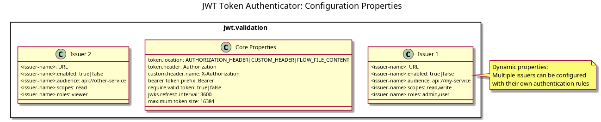

= MultiIssuerJWTTokenAuthenticator Static Configuration
:toc:
:toclevels: 3
:toc-title: Table of Contents
:sectnums:

link:../Specification.adoc[Back to Main Specification]

== Static Configuration Overview
_See Requirement link:../Requirements.adoc#NIFI-AUTH-7.7[NIFI-AUTH-7.7: Static Configuration for Container Environments]_

This document covers static configuration options for the MultiIssuerJWTTokenAuthenticator processor, focusing on container environments and automated deployments. For general configuration properties and options, see link:configuration.adoc[Configuration].

[.text-center]

== Configuration File Formats

The processor supports loading configurations from external files in multiple formats:

=== Properties Format (.properties)

[source,properties]
----
# Example properties configuration
jwt.validation.issuer.count=2

# First issuer configuration
jwt.validation.issuer.1.name=Primary Auth Server
jwt.validation.issuer.1.enabled=true
jwt.validation.issuer.1.id=primary-auth
jwt.validation.issuer.1.issuerUrl=https://auth.example.org
jwt.validation.issuer.1.jwksUrl=https://auth.example.org/.well-known/jwks.json
jwt.validation.issuer.1.tokenExpiration=3600
jwt.validation.issuer.1.requiredClaims=aud,sub
jwt.validation.issuer.1.audience=my-api
jwt.validation.issuer.1.scopes=read,write
jwt.validation.issuer.1.roles=admin,user

# Second issuer configuration
jwt.validation.issuer.2.name=Secondary Auth Server
jwt.validation.issuer.2.enabled=false
jwt.validation.issuer.2.id=secondary-auth
jwt.validation.issuer.2.issuerUrl=https://auth2.example.org
jwt.validation.issuer.2.jwksUrl=https://auth2.example.org/.well-known/jwks.json
jwt.validation.issuer.2.tokenExpiration=7200
jwt.validation.issuer.2.requiredClaims=aud,sub,roles
jwt.validation.issuer.2.audience=my-secondary-api
jwt.validation.issuer.2.scopes=read
jwt.validation.issuer.2.roles=viewer
----

=== YAML Format (.yaml, .yml)

[source,yaml]
----
jwt:
  validation:
    issuers:
      - name: "Primary Auth Server"
        enabled: true
        id: "primary-auth"
        issuerUrl: "https://auth.example.org"
        jwksUrl: "https://auth.example.org/.well-known/jwks.json"
        tokenExpiration: 3600
        requiredClaims: ["aud", "sub"]
        audience: "my-api" 
        scopes: "read,write"
        roles: "admin,user"
      
      - name: "Secondary Auth Server"
        enabled: false
        id: "secondary-auth"
        issuerUrl: "https://auth2.example.org"
        jwksUrl: "https://auth2.example.org/.well-known/jwks.json"
        tokenExpiration: 7200
        requiredClaims: ["aud", "sub", "roles"]
        audience: "my-secondary-api"
        scopes: "read"
        roles: "viewer"
----

== Static Configuration Behavior

The static configuration has the following behavioral characteristics:

[cols="2,4"]
|===
|Behavior |Description

|Active by Default
|When a valid configuration file is present, it's automatically loaded and used

|UI Transparency
|Static configuration values are displayed in the processor configuration dialog as read-only

|UI Integration
|UI displays a notification when static configuration is active

|Configuration Precedence
|Static configuration takes precedence over UI-configured values
|===

== Configuration File Locations

The processor looks for configuration files in the following locations (in order of precedence):

1. Path specified by `jwt.config.path` JVM system property
2. Path specified by `JWT_CONFIG_PATH` environment variable
3. `conf/jwt-validation.properties` or `conf/jwt-validation.yml` in the NiFi installation directory

== Dynamic Configuration Loading

=== Configuration Refresh Behavior

[source,java]
----
/**
 * Checks if the configuration file has been modified and reloads if necessary.
 */
private void checkAndReloadConfiguration() {
    if (configFile != null && configFile.exists()) {
        long lastModified = configFile.lastModified();
        if (lastModified > lastLoadedTimestamp) {
            getLogger().info("Configuration file {} has been modified, reloading", configFile);
            try {
                loadConfiguration(configFile);
                lastLoadedTimestamp = lastModified;
                configurationRefreshed = true;
            } catch (Exception e) {
                getLogger().error("Failed to reload configuration, using previous configuration", e);
            }
        }
    }
}
----

Key features of dynamic configuration:

1. The processor monitors the configuration file for changes
2. When changes are detected, configuration is automatically reloaded
3. On reload failure, the processor falls back to the previous valid configuration
4. An attribute `jwt.config.refreshed=true` is added to the first flowfile processed after a reload

=== Issuer State Changes

The processor handles issuer state changes gracefully:

1. When an issuer is disabled, it is immediately removed from the available options
2. When a new issuer is added or enabled, it becomes available without requiring a restart
3. Changes to an enabled issuer's configuration are applied immediately

== Environment Variable Configuration

For container environments, configuration can also be provided through environment variables:

[cols="2,1,3"]
|===
|Environment Variable |Type |Description

|JWT_TOKEN_HEADER_NAME
|String
|Name of the header containing the JWT token

|JWT_JWKS_REFRESH_INTERVAL
|Duration
|How often to refresh the JWKS cache (format: "15 minutes", "1 hour", etc.)

|JWT_REQUIRE_VALID_TOKEN
|Boolean
|When true, only valid tokens result in success relationship

|JWT_TOKEN_LOCATION
|String
|Where to find the token (AUTHORIZATION_HEADER, CUSTOM_HEADER, FLOW_FILE_CONTENT)

|JWT_CUSTOM_HEADER_NAME
|String
|Name of custom header when Token Location is set to CUSTOM_HEADER

|JWT_ISSUER_{name}_JWKS_URL
|URL
|JWKS endpoint URL for the issuer with name {name}

|JWT_ISSUER_{name}_PUBLIC_KEY
|String
|PEM-encoded public key for the issuer with name {name}
|===

=== Environment Variable Examples

[source,bash]
----
# Basic configuration
export JWT_TOKEN_HEADER_NAME=Authorization
export JWT_JWKS_REFRESH_INTERVAL="30 minutes"
export JWT_REQUIRE_VALID_TOKEN=true
export JWT_TOKEN_LOCATION=AUTHORIZATION_HEADER

# Issuer configurations
export JWT_ISSUER_GOOGLE_JWKS_URL=https://www.googleapis.com/oauth2/v3/certs
export JWT_ISSUER_INTERNAL_PUBLIC_KEY="-----BEGIN PUBLIC KEY-----\nMIIB...AQAB\n-----END PUBLIC KEY-----"
----

== Container Environment Integration

=== Kubernetes ConfigMap Example

[source,yaml]
----
apiVersion: v1
kind: ConfigMap
metadata:
  name: jwt-issuers-config
data:
  issuers.yaml: |
    jwt:
      validation:
        issuers:
          - name: "Primary Auth Server"
            enabled: true
            id: "primary-auth"
            issuerUrl: "https://auth.example.org"
            jwksUrl: "https://auth.example.org/.well-known/jwks.json"
            tokenExpiration: 3600
            requiredClaims: ["aud", "sub"]
            audience: "my-api" 
            scopes: "read,write"
            roles: "admin,user"
          - name: "Secondary Auth Server"
            enabled: false
            id: "secondary-auth"
            issuerUrl: "https://auth2.example.org"
            jwksUrl: "https://auth2.example.org/.well-known/jwks.json"
            tokenExpiration: 7200
            requiredClaims: ["aud", "sub", "roles"]
            audience: "my-secondary-api"
            scopes: "read"
            roles: "viewer"
----

=== Docker Compose Example

[source,yaml]
----
version: '3'
services:
  nifi:
    image: apache/nifi:2.3.0
    ports:
      - "8443:8443"
    volumes:
      - ./config/issuers.yaml:/opt/nifi/nifi-current/conf/jwt-validation.yaml:ro
    environment:
      - NIFI_WEB_HTTPS_PORT=8443
      - SINGLE_USER_CREDENTIALS_USERNAME=admin
      - SINGLE_USER_CREDENTIALS_PASSWORD=Password123
      - JWT_JWKS_REFRESH_INTERVAL=30 minutes
----

== Error Handling

The processor implements robust error handling for configuration loading:

[source,java]
----
/**
 * Handles a configuration error by adding error attributes and routing to failure.
 */
private void handleConfigurationError(FlowFile flowFile, ProcessSession session, String errorCode, String message) {
    Map<String, String> attributes = new HashMap<>();
    attributes.put("jwt.config.error.code", errorCode);
    attributes.put("jwt.config.error.reason", message);
    flowFile = session.putAllAttributes(flowFile, attributes);
    
    session.transfer(flowFile, CONFIGURATION_ERROR);
    getLogger().error("Configuration error ({}): {}", errorCode, message);
}
----

Error handling features:

1. If a configuration file cannot be parsed, an error is logged and the processor falls back to the last valid configuration
2. If no valid configuration has been loaded, flowfiles are routed to the `failure` relationship
3. Detailed error information is added to flowfile attributes with the prefix `jwt.config.error`

== Security Considerations

=== File Permissions

When deploying in containerized environments, ensure that:

1. Configuration files have appropriate read permissions for the NiFi process user
2. Configuration files are mounted as read-only to prevent unauthorized modifications
3. Sensitive configuration like private keys are properly secured using Kubernetes Secrets or similar mechanisms

=== JWKS URL Security

Best practices for secure configuration:

1. JWKS URLs should use HTTPS to ensure secure key retrieval
2. Use mutual TLS authentication for JWKS endpoints in high-security environments
3. Implement proper network security controls to restrict access to JWKS endpoints

== Related Topics

* link:configuration.adoc[Configuration Overview]
* link:configuration-ui.adoc[UI Configuration]
* link:token-validation.adoc[Token Validation]
* link:security.adoc[Security]
* link:error-handling.adoc[Error Handling]