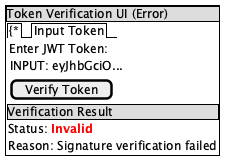

= MultiIssuerJWTTokenAuthenticator UI Configuration
:toc:
:toclevels: 3
:toc-title: Table of Contents
:sectnums:

xref:../Specification.adoc[Back to Main Specification]

== UI Configuration Overview
_See Requirement xref:../Requirements.adoc#NIFI-AUTH-7.1[NIFI-AUTH-7.1: UI Configuration]_

This document covers the user interface elements and interaction patterns for configuring the MultiIssuerJWTTokenAuthenticator processor. For general configuration properties and options, see xref:configuration.adoc[Configuration].

[.text-center]
image::../plantuml/configuration-workflow.png[Configuration Workflow Diagram, align="center"]

== Implementation Status

=== Implementation Classes
* link:../../nifi-cuioss-common/src/main/java/de/cuioss/nifi/jwt/config/IssuerPropertyDescriptorFactory.java[IssuerPropertyDescriptorFactory] -- Dynamic property descriptor creation for issuers
* link:../../nifi-cuioss-processors/src/main/java/de/cuioss/nifi/processors/auth/JWTProcessorConstants.java[JWTProcessorConstants] -- Processor property definitions and relationships
* link:../../nifi-cuioss-common/src/main/java/de/cuioss/nifi/jwt/JWTPropertyKeys.java[JWTPropertyKeys] -- Property key constants for issuer configuration
* link:../../nifi-cuioss-common/src/main/java/de/cuioss/nifi/jwt/JWTTranslationKeys.java[JWTTranslationKeys] -- Translation key constants for UI labels

=== Verification
* link:../../nifi-cuioss-common/src/test/java/de/cuioss/nifi/jwt/config/IssuerPropertyDescriptorFactoryTest.java[IssuerPropertyDescriptorFactoryTest]

== UI Property Organization

The processor UI organizes properties into logical groups for better usability:

=== Standard Properties Tab

[.text-center]
image::../plantuml/configuration-properties-ui.png[Configuration Properties UI, align="center"]

Properties in the UI are organized into sections:

1. **Basic Properties**: Core settings displayed by default
   - jwt.issuer.config.service (Controller Service reference)
   - jwt.validation.token.attribute
   - jwt.validation.require.valid.token

2. **Advanced Properties**: Additional settings available through the "Advanced" button
   - jwt.validation.required.roles
   - jwt.validation.required.scopes

3. **Dynamic Properties**: User-defined issuer configurations
   - Each issuer has its own property entry using `issuer.<N>.<property>` naming
   - Issuer-specific authorization settings:
     - issuer.<N>.audience
     - issuer.<N>.scopes
     - issuer.<N>.roles

=== Dynamic Properties

[.text-center]
image::../plantuml/configuration-issuers-ui.png[Issuer Management UI, align="center"]

Each issuer requires a unique Name and a validated Type. The Type determines how the JWKS is provided:

- **JWKS-Server**: Enter a JWKS URL and use the Validate button to check connectivity and key structure.
- **Local File**: Enter a file path and use the Validate button to check file existence and content.
- **In Memory**: Paste the JWKS content and use the Validate button to check the format and keys.

Validation of the selected Type is mandatory before an issuer can be saved. All other fields (Audience, Scopes, Roles) are optional.

=== Property Dependencies

The processor implements property dependencies to enhance usability. See link:../../nifi-cuioss-processors/src/main/java/de/cuioss/nifi/processors/auth/MultiIssuerJWTTokenAuthenticator.java[MultiIssuerJWTTokenAuthenticator] for the property modification handling and link:../../nifi-cuioss-processors/src/main/java/de/cuioss/nifi/processors/auth/JWTProcessorConstants.java[JWTProcessorConstants] for property definitions.

== Custom UI Components

The processor provides several custom UI components to aid in configuration and validation:

=== JWKS Validation Button
_See Requirement xref:../Requirements.adoc#NIFI-AUTH-7.1[NIFI-AUTH-7.1: UI Configuration]_

The processor includes a custom UI component to validate the JWKS configuration for the selected type:

- **JWKS-Server**: Validates the endpoint connectivity and key structure.
- **Local File**: Validates the file existence and content.
- **In Memory**: Validates the pasted JWKS content format and keys.

The validation button adapts to the selected JWKS type and always validates the current input.

The JWKS validation UI is implemented in the custom web application:

* link:../../nifi-cuioss-ui/src/main/webapp/js/issuer-config.js[issuer-config.js] -- Issuer configuration form with JWKS type selection and validation button
* link:../../nifi-cuioss-ui/src/main/webapp/js/api.js[api.js] -- API client that calls the backend validation endpoints

=== Token Verification Interface
_See Requirement xref:../Requirements.adoc#NIFI-AUTH-7.3[NIFI-AUTH-7.3: Verification]_

The processor includes a token verification interface to test JWT tokens:

[.text-center]
image::../plantuml/token-verification-ui.png[Token Verification UI (Success), align="center"]

This interface allows users to:

1. Paste a JWT token for validation
2. Verify the token against the configured issuers
3. View detailed token information including claims
4. Diagnose validation failures

==== Backend Integration (REST Call)

When the user clicks "Verify Token", the UI sends the JWT token to a backend REST endpoint (`/nifi-api/processors/jwt/verify-token`). The backend:

- Retrieves the current IssuerConfig objects from the processor configuration.
- Creates a new SecurityEventCounter for this request.
- Instantiates a new TokenValidator with the IssuerConfigs and the new SecurityEventCounter.
- Calls `createAccessToken(tokenString)` on the TokenValidator.
- Returns the validation result and error details (from the SecurityEventCounter) as a JSON response to the UI.

This ensures that each UI verification is isolated, does not affect processor metrics, and provides detailed feedback to the user.

In case of an error, the interface displays a clear error message and does not show token details:

[.text-center]

The error state highlights the invalid status in red and provides the reason for the failure (e.g., signature verification failed).

== Custom UI Tabs

The processor configuration dialog includes custom tabs for extended functionality:

=== Properties Tab
The standard NiFi properties tab with the processor's configuration properties.

=== Gateway Configuration Tab
For the `RestApiGatewayProcessor`, an **Endpoint Configuration** tab replaces
the standard issuer-management UI. It provides a CRUD editor for route
definitions and tracks persisted vs session-only changes with visual origin
badges. See link:gateway-ui.adoc[REST API Gateway — Custom UI] for details.

=== Verification Tab
Provides the token verification interface for testing tokens against the current configuration.

=== Metrics Tab

[.text-center]
image::../plantuml/configuration-metrics-ui.png[Metrics & Statistics UI, align="center"]

Displays security event metrics and validation statistics:

* Token validation success/failure rates
* Issuer usage statistics
* Performance metrics (validation time)
* Recent validation errors

=== Help Tab
Provides inline documentation and usage examples specific to the processor.

== Internationalized UI Elements
_See Requirement xref:../Requirements.adoc#NIFI-AUTH-17[NIFI-AUTH-17: Internationalization Support]_

All UI elements use internationalization through NiFi's I18nResolver API. See link:../../nifi-cuioss-common/src/main/java/de/cuioss/nifi/jwt/config/IssuerPropertyDescriptorFactory.java[IssuerPropertyDescriptorFactory] for how translated property descriptors are created using link:../../nifi-cuioss-common/src/main/java/de/cuioss/nifi/jwt/JWTTranslationKeys.java[JWTTranslationKeys].

For more details on internationalization, see xref:internationalization.adoc[Internationalization].

== Custom Validators

The processor uses custom validators in the UI to ensure proper configuration:

=== JWKS Endpoint Validator

The JWKS Endpoint Validator is now type-aware and uses the JwksLoaderFactory directly to validate the JWKS configuration for the selected type. It also uses a SecurityEventCounter to track and report validation problems.

- The validator receives the JWKS type (e.g., "server", "file", "memory") as a parameter.
- It uses JwksLoaderFactory to create the appropriate loader for the type and input value.
- A new SecurityEventCounter is created for each validation attempt.
- The loader is used to load and validate the JWKS, and any errors are reported using the SecurityEventCounter.
- The ValidationResult reflects the outcome, including error details if validation fails.

The actual JWKS validation is implemented in link:../../nifi-cuioss-ui/src/main/java/de/cuioss/nifi/ui/servlets/JwksValidationServlet.java[JwksValidationServlet], which handles all three JWKS source types (URL, file, in-memory) with full error reporting via SecurityEventCounter.

This approach ensures that the validator is flexible, robust, and provides detailed feedback for all supported JWKS types.

== UI State Management

=== UI Configuration Persistence

UI configuration state is persisted through several mechanisms:

1. **NiFi Flow Configuration**: Most settings are stored in the NiFi flow configuration
2. **Browser Storage**: Some UI-specific state (like verification results) is stored in browser local storage
3. **In-memory State**: Processor metrics are stored in memory and lost on restart

=== Static Configuration Display

When static configuration is active, the UI:

1. Displays the static configuration values as read-only
2. Shows a notification indicating that static configuration is active
3. Disables editing of properties defined in the static configuration
4. Allows editing of properties not defined in the static configuration

== Related Topics

* xref:configuration.adoc[Configuration Overview]
* xref:configuration-static.adoc[Static Configuration]
* xref:token-validation.adoc[Token Validation]
* xref:internationalization.adoc[Internationalization]