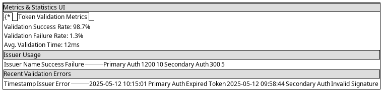

= MultiIssuerJWTTokenAuthenticator UI Configuration
:toc:
:toclevels: 3
:toc-title: Table of Contents
:sectnums:

link:../Specification.adoc[Back to Main Specification]

== UI Configuration Overview
_See Requirement link:../Requirements.adoc#NIFI-AUTH-7.1[NIFI-AUTH-7.1: UI Configuration]_

This document covers the user interface elements and interaction patterns for configuring the MultiIssuerJWTTokenAuthenticator processor. For general configuration properties and options, see link:configuration.adoc[Configuration].

[.text-center]

== UI Property Organization

The processor UI organizes properties into logical groups for better usability:

=== Standard Properties Tab

[.text-center]
image::../plantuml/configuration-properties-ui.png[Configuration Properties UI, align="center"]

Properties in the UI are organized into sections:

1. **Basic Properties**: Core settings displayed by default
   - jwt.validation.token.location
   - jwt.validation.custom.header.name

2. **Advanced Properties**: Additional settings available through the "Advanced" button
   - jwt.validation.token.header
   - jwt.validation.jwks.refresh.interval
   - jwt.validation.require.valid.token
   - jwt.validation.maximum.token.size

3. **Dynamic Properties**: User-defined issuer configurations
   - Each issuer has its own property entry with the issuer name as the property name
   - Issuer-specific authorization settings:
     - jwt.validation.<issuer-name>.audience
     - jwt.validation.<issuer-name>.scopes
     - jwt.validation.<issuer-name>.roles

=== Dynamic Properties

[.text-center]
image::../plantuml/configuration-issuers-ui.png[Issuer Management UI, align="center"]

Each issuer requires a unique Name and a validated Type. The Type determines how the JWKS is provided:

- **JWKS-Server**: Enter a JWKS URL and use the Validate button to check connectivity and key structure.
- **Local File**: Enter a file path and use the Validate button to check file existence and content.
- **In Memory**: Paste the JWKS content and use the Validate button to check the format and keys.

Validation of the selected Type is mandatory before an issuer can be saved. All other fields (Audience, Scopes, Roles) are optional.

=== Property Dependencies

The processor implements property dependencies to enhance usability:

[source,java]
----
@OnPropertyModified("jwt.validation.token.location")
public void onTokenLocationModified(final PropertyConfiguration oldValue, 
                                    final PropertyConfiguration newValue) {
    String newLocation = newValue.getValue();
    if ("CUSTOM_HEADER".equals(newLocation)) {
        // Make Custom Header Name property visible and required
        getPropertyConfiguration("jwt.validation.custom.header.name").setVisible(true).setRequired(true);
    } else {
        // Hide Custom Header Name property
        getPropertyConfiguration("jwt.validation.custom.header.name").setVisible(false).setRequired(false);
    }
}
----

== Custom UI Components

The processor provides several custom UI components to aid in configuration and validation:

=== JWKS Endpoint Test Button
_See Requirement link:../Requirements.adoc#NIFI-AUTH-7.4[NIFI-AUTH-7.4: JWKS Verification]_

The processor includes a custom UI component to test JWKS endpoint connectivity:

[source,javascript]
----
/**
 * JWKS Test Button UI component.
 */
define(['jquery', 'nf.Common'], function ($, nfCommon) {
    return {
        /**
         * Initialize the custom UI.
         */
        init: function (element, propertyValue, callback) {
            // Get i18n resources from NiFi Common
            var i18n = nfCommon.getI18n();
            
            // Create UI elements
            var container = $('

');
            var verifyButton = $('<button type="button" class="verify-jwks-button">' + 
                               i18n['processor.jwt.testConnection'] + '</button>');
            var resultContainer = $('

');
            
            // Add elements to the DOM
            container.append(verifyButton).append(resultContainer);
            $(element).append(container);
            
            // Handle button click - simplified for documentation
            verifyButton.on('click', function () {
                // Implementation details...
            });
            
            // Initialize callback
            callback({
                validate: function () { return true; },
                getValue: function () { return propertyValue; },
                setValue: function (newValue) { propertyValue = newValue; }
            });
        }
    };
}
----

=== Token Verification Interface
_See Requirement link:../Requirements.adoc#NIFI-AUTH-7.3[NIFI-AUTH-7.3: Verification]_

The processor includes a token verification interface to test JWT tokens:

[.text-center]
image::../plantuml/token-verification-ui.png[Token Verification UI, align="center"]

This interface allows users to:

1. Paste a JWT token for validation
2. Verify the token against the configured issuers
3. View detailed token information including claims
4. Diagnose validation failures

== Custom UI Tabs

The processor configuration dialog includes custom tabs for extended functionality:

=== Properties Tab
The standard NiFi properties tab with the processor's configuration properties.

=== Verification Tab
Provides the token verification interface for testing tokens against the current configuration.

=== Metrics Tab

[.text-center]

Displays security event metrics and validation statistics:

* Token validation success/failure rates
* Issuer usage statistics
* Performance metrics (validation time)
* Recent validation errors

=== Help Tab
Provides inline documentation and usage examples specific to the processor.

== Internationalized UI Elements
_See Requirement link:../Requirements.adoc#NIFI-AUTH-17[NIFI-AUTH-17: Internationalization Support]_

All UI elements use internationalization through NiFi's I18nResolver API:

[source,java]
----
/**
 * Initialize internationalization support.
 */
@Override
protected void init(final ProcessorInitializationContext context) {
    // Create i18nResolver based on the logger
    i18nResolver = NiFiI18nResolver.createDefault(context.getLogger());
    
    // Other initialization code...
}

/**
 * Define internationalized property descriptors.
 */
public static final PropertyDescriptor TOKEN_HEADER = new PropertyDescriptor.Builder()
    .name("Token Header")
    .displayName(i18nResolver.getTranslatedString("property.token.header.name"))
    .description(i18nResolver.getTranslatedString("property.token.header.description"))
    .required(true)
    .defaultValue("Authorization")
    .addValidator(StandardValidators.NON_EMPTY_VALIDATOR)
    .build();
----

For more details on internationalization, see link:internationalization.adoc[Internationalization].

== Custom Validators

The processor uses custom validators in the UI to ensure proper configuration:

=== JWKS Endpoint Validator

Validates JWKS endpoint URLs and public keys:

[source,java]
----
/**
 * Validates JWKS URLs and public keys.
 */
public class JwksEndpointValidator implements Validator {
    @Override
    public ValidationResult validate(String subject, String input, ValidationContext context) {
        if (StringUtils.isBlank(input)) {
            return new ValidationResult.Builder()
                .input(input)
                .subject(subject)
                .valid(false)
                .explanation("Value cannot be empty")
                .build();
        }
        
        // Check if the input is a URL
        if (input.startsWith("http://") || input.startsWith("https://")) {
            // Validate HTTPS requirement
            if (!input.startsWith("https://")) {
                return new ValidationResult.Builder()
                    .input(input)
                    .subject(subject)
                    .valid(false)
                    .explanation("JWKS URL must use HTTPS for security")
                    .build();
            }
            
            // Valid URL format
            return new ValidationResult.Builder()
                .input(input)
                .subject(subject)
                .valid(true)
                .build();
        } else {
            // Validate as PEM-encoded public key format
            return validatePemFormat(input, subject);
        }
    }
    
    // Additional validation methods...
}
----

== UI State Management

=== UI Configuration Persistence

UI configuration state is persisted through several mechanisms:

1. **NiFi Flow Configuration**: Most settings are stored in the NiFi flow configuration
2. **Browser Storage**: Some UI-specific state (like verification results) is stored in browser local storage
3. **In-memory State**: Processor metrics are stored in memory and lost on restart

=== Static Configuration Display

When static configuration is active, the UI:

1. Displays the static configuration values as read-only
2. Shows a notification indicating that static configuration is active
3. Disables editing of properties defined in the static configuration
4. Allows editing of properties not defined in the static configuration

== Related Topics

* link:configuration.adoc[Configuration Overview]
* link:configuration-static.adoc[Static Configuration]
* link:token-validation.adoc[Token Validation]
* link:internationalization.adoc[Internationalization]