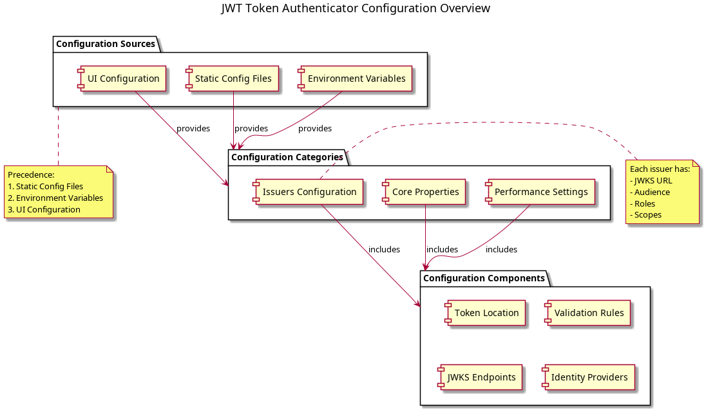

= MultiIssuerJWTTokenAuthenticator Configuration
:toc: left
:toclevels: 3
:toc-title: Table of Contents
:sectnums:
:source-highlighter: highlight.js
:imagesdir: ../plantuml

xref:../Specification.adoc[Back to Main Specification]

== Overview
_See Requirement xref:../Requirements.adoc#NIFI-AUTH-7[NIFI-AUTH-7: Configuration Requirements]_

The MultiIssuerJWTTokenAuthenticator processor provides comprehensive configuration options for validating and processing JWT tokens. This document serves as the central reference for all configuration options.

[.text-center]

=== Configuration Methods

The processor supports three configuration methods:

1. **UI Configuration** - Interactive configuration through the NiFi Web UI
2. **Static Configuration Files** - Configuration through properties or YAML files
3. **Environment Variables** - Configuration through environment variables for containerized environments

== Configuration Properties

=== Core Properties
_See Requirement xref:../Requirements.adoc#NIFI-AUTH-7.2[NIFI-AUTH-7.2: Token Validation Configuration]_

[cols="1,1,3,1"]
|===
|Property |Default |Description |Required

|jwt.validation.token.location
|AUTHORIZATION_HEADER
|Defines where to extract the token from (AUTHORIZATION_HEADER, CUSTOM_HEADER, FLOW_FILE_CONTENT)
|Yes

|jwt.validation.token.header
|Authorization
|The header name containing the token when using AUTHORIZATION_HEADER
|No

|jwt.validation.custom.header.name
|X-Authorization
|The custom header name when using CUSTOM_HEADER
|No

|jwt.validation.bearer.token.prefix
|Bearer
|The prefix to strip from the token (e.g., "Bearer ")
|No

|jwt.validation.require.valid.token
|true
|Whether to require a valid token for processing
|Yes
|===

=== Authorization Properties
_See Requirement xref:../Requirements.adoc#NIFI-AUTH-7.4[NIFI-AUTH-7.4: Authorization Configuration]_

Note: The audience, scopes, and roles authorization settings have been moved to issuer-specific configurations.

=== Performance Properties
_See Requirement xref:../Requirements.adoc#NIFI-AUTH-9[NIFI-AUTH-9: Performance Requirements]_

[cols="1,1,3,1"]
|===
|Property |Default |Description |Required

|jwt.validation.jwks.refresh.interval
|3600
|Interval in seconds for refreshing JWKS keys
|Yes

|jwt.validation.maximum.token.size
|16384
|Maximum token size in bytes
|Yes
|===

=== Dynamic Properties (Issuers)
_See Requirement xref:../Requirements.adoc#NIFI-AUTH-4[NIFI-AUTH-4: Multiple Issuer Support]_

The processor supports multiple issuers through dynamic properties:

[cols="1,3,1"]
|===
|Property |Description |Example

|jwt.validation.<issuer-name>
|The JWKS URL or public key for the issuer
|https://auth.example.com/.well-known/jwks.json

|jwt.validation.<issuer-name>.enabled
|Whether this issuer is enabled (true/false)
|true

|jwt.validation.<issuer-name>.audience
|Required audience for this specific issuer
|api://my-service

|jwt.validation.<issuer-name>.scopes
|Comma-separated list of scopes required for this issuer
|read,write

|jwt.validation.<issuer-name>.roles
|Comma-separated list of roles required for this issuer
|admin,user
|===

== Configuration Methods

=== UI Configuration

The processor provides a comprehensive user interface for configuration through the NiFi Web UI. UI Configuration includes:

* Core and advanced property configuration
* Dynamic issuer management
* JWKS endpoint verification
* Token validation testing

For detailed information about UI configuration, see xref:configuration-ui.adoc[UI Configuration].

=== Static Configuration Files

For containerized environments and automated deployments, the processor supports configuration through external files in multiple formats:

* Properties (.properties)
* YAML (.yaml, .yml)

Static configuration files can be placed in standard locations or specified through system properties and environment variables.

For detailed information about static file configuration, see xref:configuration-static.adoc[Static Configuration].

=== Environment Variables

For container environments, configuration can also be provided through environment variables, making it suitable for Kubernetes, Docker, and other container orchestration platforms.

The configuration precedence order is:
1. Static configuration files
2. Environment variables
3. UI configuration

For detailed information about environment variable configuration, see xref:configuration-static.adoc#environment-variable-configuration[Environment Variable Configuration].

== Common Configuration Scenarios

=== Basic Configuration with Single Issuer

[source,properties]
----
# Static properties
jwt.validation.token.location = AUTHORIZATION_HEADER
jwt.validation.token.header = Authorization
jwt.validation.bearer.token.prefix = Bearer
jwt.validation.require.valid.token = true
jwt.validation.required.audience = api://my-service
jwt.validation.jwks.refresh.interval = 3600

# Dynamic properties (issuers)
jwt.validation.auth.server = https://auth-server.example.com/.well-known/jwks.json
----

=== Advanced Configuration with Multiple Issuers

[source,properties]
----
# Static properties
jwt.validation.token.location = AUTHORIZATION_HEADER
jwt.validation.token.header = Authorization
jwt.validation.bearer.token.prefix = Bearer
jwt.validation.require.valid.token = true
jwt.validation.required.scopes = read,write
jwt.validation.jwks.refresh.interval = 1800

# Dynamic properties (issuers)
jwt.validation.auth.server.production = https://auth.example.com/.well-known/jwks.json
jwt.validation.auth.server.production.audience = api://my-service-prod

jwt.validation.auth.server.testing = https://auth-test.example.com/.well-known/jwks.json
jwt.validation.auth.server.testing.audience = api://my-service-test
jwt.validation.auth.server.testing.enabled = false  # Disabled in production
----

== See Also

=== Core Documentation
* xref:../Specification.adoc[Main Specification]
* xref:../Requirements.adoc[Requirements]

=== Configuration Details
* xref:configuration-ui.adoc[UI Configuration]
* xref:configuration-static.adoc[Static Configuration]

=== Related Implementation
* xref:token-validation.adoc[Token Validation]
* xref:technical-components.adoc[Technical Components]
* xref:error-handling.adoc[Error Handling]
