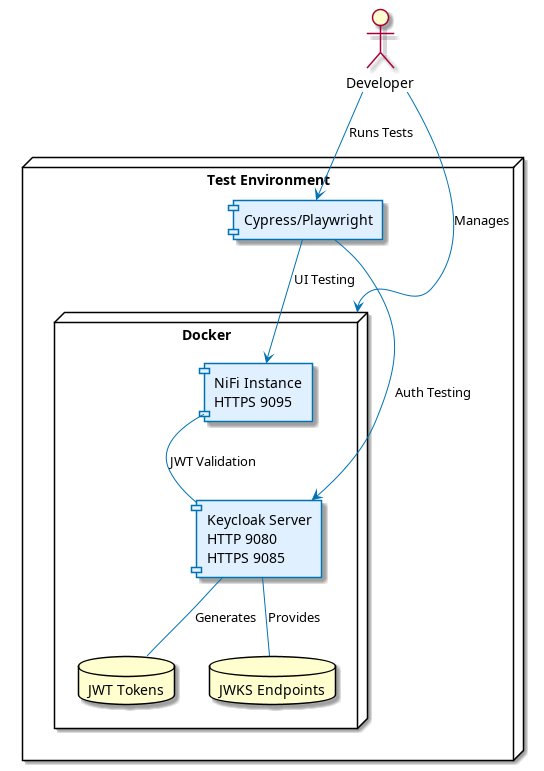

= NiFi Extensions End-to-End Testing
:toc: left
:toclevels: 3
:toc-title: Table of Contents
:sectnums:
:source-highlighter: highlight.js

xref:../Specification.adoc[Back to Main Specification]

== Referenced Implementation

=== Test Modules
* link:../../e-2-e-playwright/[e-2-e-playwright] -- Playwright E2E and WCAG accessibility tests
* link:../../integration-testing/[integration-testing] -- Docker-based integration tests (NiFi + Keycloak)

=== Implementation Guides
* link:../../e-2-e-playwright/docs/implementation-guide.adoc[End-to-End Testing Implementation Guide] -- test architecture and patterns
* link:../../e-2-e-playwright/docs/nifi-ui-structure.adoc[NiFi UI Structure Guide] -- selectors, authentication flow
* link:../../e-2-e-playwright/docs/roundtrip-testing.adoc[Roundtrip Testing Guide] -- development workflow: modify, deploy, test, analyze
* link:../../e-2-e-playwright/docs/accessibility-testing-guide.adoc[Accessibility Testing Guide] -- WCAG 2.1 Level AA compliance
* link:../../e-2-e-playwright/docs/processor-api-manager-guide.adoc[Processor API Manager Guide] -- REST API-based processor management
* link:../../e-2-e-playwright/docs/test-logging.adoc[Test Logging Guide] -- per-test artifact persistence

== Overview
_See Requirement xref:../Requirements.adoc#NIFI-AUTH-15[NIFI-AUTH-15: Integration Testing]_

This document specifies **what** the end-to-end tests must verify. For setup, execution, and debugging details see the link:../../e-2-e-playwright/README.adoc[E2E Playwright README] and the implementation guides above.

Tests run against a containerized NiFi + Keycloak environment (see link:../../integration-testing/README.adoc[Integration Testing]) using the Playwright framework with Chromium.

== Testing Goals

1. **Verify Complete User Flows** -- test entire user journeys from start to finish
2. **Validate UI Functionality** -- ensure all custom UI tabs and components work correctly
3. **Test Integration Points** -- verify proper integration between UI and backend services (NiFi REST API, Keycloak)
4. **Detect Regressions** -- identify when changes break existing functionality
5. **Ensure Accessibility** -- verify WCAG 2.1 Level AA compliance

== Test Categories

Tests are organized into three categories, executed in order:

=== Self-Tests

Framework validation tests that verify prerequisites before functional tests run.

[cols="2,3,2"]
|===
|Test |What it verifies |Implementation

|Login
|Authentication with valid credentials, logout, session persistence
|link:../../e-2-e-playwright/tests/self-login.spec.js[self-login.spec.js]

|Navigation
|Canvas navigation, URL structure, page readiness, back/forward
|link:../../e-2-e-playwright/tests/self-navigation.spec.js[self-navigation.spec.js]

|Critical Error Detection
|Empty page, UI stalls, JS errors, RequireJS failures, missing processors
|link:../../e-2-e-playwright/tests/self-critical-errors.spec.js[self-critical-errors.spec.js]

|Processor API Manager
|REST API-based processor lifecycle (deploy, add, remove, start, stop)
|link:../../e-2-e-playwright/tests/self-processor-api-manager.spec.js[self-processor-api-manager.spec.js]

|Processor Advanced Configuration
|Configuration dialog, advanced properties, "Back to Processor" navigation
|link:../../e-2-e-playwright/tests/self-processor-advanced.spec.js[self-processor-advanced.spec.js]
|===

=== Functional Tests

==== Processor Configuration Flow

Tests the Configuration tab and issuer management.

**Implementation:** link:../../e-2-e-playwright/tests/01-verify-configuration-tab.spec.js[01-verify-configuration-tab.spec.js]

Verified scenarios:

1. Display configuration tab structure (form fields, layout)
2. Add issuer and verify form fields (JWKS URL, audience, scopes, roles)
3. Handle issuer configuration interactions (save, edit, delete)

==== JWKS Validation Flow

Tests JWKS endpoint validation across all source types.

**Implementation:** link:../../e-2-e-playwright/tests/02-verify-jwks-validation.spec.js[02-verify-jwks-validation.spec.js]

Verified scenarios:

1. Validate JWKS URL successfully (valid Keycloak endpoint)
2. Handle invalid JWKS URL (error messages)
3. Validate JWKS file path
4. Display validation progress indicator

==== Token Verification Flow

Tests the Token Verification tab with valid and invalid tokens.

**Implementation:** link:../../e-2-e-playwright/tests/03-verify-token-verification-tab.spec.js[03-verify-token-verification-tab.spec.js]

Verified scenarios:

1. Access token verification tab
2. Verify valid JWT token (claims display, issuer, expiration)
3. Handle invalid JWT token (error messages)
4. Display token expiration status
5. Clear token and results

==== Metrics and Statistics Flow

Tests the Metrics tab dashboard and data display.

**Implementation:** link:../../e-2-e-playwright/tests/04-verify-metrics-tab.spec.js[04-verify-metrics-tab.spec.js]

Verified scenarios:

1. Display metrics dashboard
2. Show validation success and failure rates
3. Display issuer-specific metrics
4. Show performance metrics
5. Refresh metrics data
6. Export metrics data

==== Help Tab

Tests the Help tab documentation and interactive features.

**Implementation:** link:../../e-2-e-playwright/tests/05-verify-help-tab.spec.js[05-verify-help-tab.spec.js]

Verified scenarios:

1. Display help documentation
2. Expandable help sections
3. Display configuration examples
4. Copy code functionality
5. Display troubleshooting guide
6. Search functionality

==== Gateway Tabs

Tests the Custom UI displays gateway-specific tabs and content for the RestApiGatewayProcessor.

**Implementation:** link:../../e-2-e-playwright/tests/06-verify-gateway-tabs.spec.js[06-verify-gateway-tabs.spec.js]

Verified scenarios:

1. Display gateway-specific tabs in custom UI (Endpoint Configuration, Endpoint Tester, Issuer Configuration, Token Verification, Metrics, Help)
2. Verify endpoint configuration tab content
3. Verify endpoint tester functionality
4. Verify issuer configuration tab content
5. Verify token verification tab functionality

=== Accessibility Tests

WCAG 2.1 Level AA compliance testing using @axe-core/playwright.

**Implementation:** link:../../e-2-e-playwright/tests/accessibility-wcag-compliance.spec.js[accessibility-wcag-compliance.spec.js]

For detailed testing methodology and configuration, see link:../../e-2-e-playwright/docs/accessibility-testing-guide.adoc[Accessibility Testing Guide].

Verified scenarios:

1. Full page WCAG compliance check
2. Component-level accessibility checks
3. Form field labeling and associations
4. Keyboard navigation and focus management
5. ARIA attributes and roles
6. Color contrast and visual design
7. Screen reader compatibility
8. Dynamic content accessibility
9. Generate comprehensive accessibility report

== See Also

* xref:testing.adoc[Testing]
* xref:integration-testing.adoc[Integration Testing — Flow Pipeline Design]
* xref:configuration-ui.adoc[UI Configuration]
* xref:token-validation.adoc[Token Validation]
* xref:../Requirements.adoc#NIFI-AUTH-15[Integration Testing Requirements]
* xref:../../integration-testing/README.adoc[Integration Testing Environment]
* xref:../Specification.adoc[Back to Main Specification]
