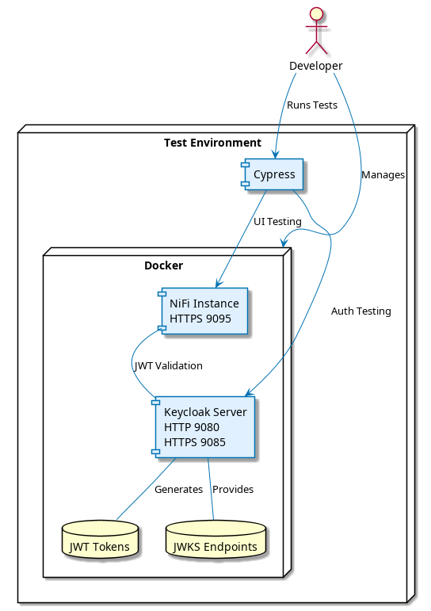

= MultiIssuerJWTTokenAuthenticator End-to-End Testing
:toc:
:toclevels: 3
:toc-title: Table of Contents
:sectnums:

link:../Specification.adoc[Back to Main Specification]

== End-to-End Testing Overview
_See Requirement link:../Requirements.adoc#NIFI-AUTH-16[NIFI-AUTH-16: Testing]_

This document outlines the end-to-end testing strategy for the MultiIssuerJWTTokenAuthenticator, focusing on automated UI testing with Playwright. The tests verify user flows through the application's user interface, ensuring that the entire application works as expected from a user's perspective with all UI components working together in a real environment.

[NOTE]
====
End-to-end testing typically takes 15-30 minutes for a complete test suite run, depending on the environment specifications and test coverage.
====

[IMPORTANT]
====
This document focuses on WHAT to test (specification). For details on HOW to implement these tests, see the implementation guide in the e-2-e-playwright/docs directory:

* link:../../e-2-e-playwright/docs/implementation-guide.adoc[End-to-End Testing Implementation Guide]
* link:../../e-2-e-playwright/docs/Testing-Scope.adoc[Testing Scope and Capabilities]
* link:../../e-2-e-playwright/docs/nifi-ui-structure.adoc[NiFi UI Structure Guide]
====

== Testing Goals and Objectives

=== Primary Goals

1. **Verify Complete User Flows**: Test entire user journeys from start to finish
2. **Validate UI Functionality**: Ensure all UI components work correctly
3. **Test Integration Points**: Verify proper integration between UI and backend services
4. **Ensure Data Integrity**: Validate that data flows correctly through the system
5. **Detect Regression Issues**: Identify when changes break existing functionality

=== Success Criteria

1. All critical user flows pass automated end-to-end tests
2. Tests run reliably with minimal flakiness
3. Test coverage includes all major UI components and interactions
4. Tests are maintainable and can be extended as new features are added
5. Tests are integrated into the CI/CD pipeline

== Testing Tools and Framework

=== Core Technologies

The end-to-end testing infrastructure uses modern, industry-standard tools:

* **Playwright** (v1.32.0 or higher): Framework for end-to-end testing and cross-browser testing
* **Docker** (v24.x or higher): For containerized testing environment
* **Integration Testing Module**: For controlling runtime instances including NiFi and Keycloak
* **cui-test-keycloak-integration** (v1.0.x): For integration testing with Keycloak
* **CI/CD Integration**: GitHub Actions for automated test execution

[TIP]
====
For definitions of specialized testing terms used in this document:

* **Flakiness**: Tests that pass or fail inconsistently when no changes are made to the code
* **NAR file**: NiFi Archive file, a package format for NiFi processors
* **JWKS**: JSON Web Key Set, a standard format for publishing public keys used to verify JWT signatures
====

=== Integration Testing Module

The project includes a dedicated `integration-testing` module that provides a Docker-based test environment with:

* **NiFi Instance**: Running the latest version with the MultiIssuerJWTTokenAuthenticator processor
  * Resource requirements: 2 CPU cores, 2GB RAM minimum
  * Exposed on HTTPS port 9095
* **Keycloak Server**: For generating valid JWT tokens and simulating different identity providers
  * Resource requirements: 1 CPU core, 1GB RAM minimum
  * Exposed on HTTP port 9080 and HTTPS port 9085
* **Pre-configured Certificates**: For secure communication between components
* **Helper Scripts**: For starting, stopping, and managing the environment

This module simplifies end-to-end testing by providing a consistent, reproducible environment that closely mirrors production deployments.

== Test Environment Setup

The following diagram illustrates the architecture of the end-to-end testing environment. This visual representation helps understand the relationships between components and how they interact during testing:

[NOTE]
====
The environment requires network connectivity between all components. The host machine needs outbound access to pull Docker images and dependencies during setup.
====

=== Containerized Testing Environment

End-to-end tests run in a containerized environment provided by the `integration-testing` module:

1. **NiFi Instance**: Running on HTTPS port 9095 with the MultiIssuerJWTTokenAuthenticator processor
   * Authentication with SingleUserLoginIdentityProvider
   * Credentials: admin/adminadminadmin
   * Processor mounted via volume for easy updates during development

2. **Keycloak Server**: Running on HTTP port 9080 and HTTPS port 9085
   * Admin credentials: admin/admin
   * Pre-configured realm (`oauth_integration_tests`) with:
     * Test user: testUser/drowssap
     * Test client: test_client/yTKslWLtf4giJcWCaoVJ20H8sy6STexM

3. **Certificate Configuration**:
   * Self-signed certificate for localhost (1 year validity)
   * NiFi: PKCS12 format (keystore.p12, truststore.p12)
   * Keycloak: PEM format (localhost.crt, localhost.key)

4. **Browser Environment**: Cross-browser testing with Playwright supports:
   * Chrome/Chromium (primary testing browser)
   * Firefox (configurable in playwright.config.js)
   * WebKit/Safari (configurable in playwright.config.js)
   * Edge (via Chromium)

   The primary development and testing browser is Chrome/Chromium, with additional browsers configurable in the playwright.config.js file for CI/CD pipelines.

== End-to-End Test Scenarios

=== Processor Configuration Flow

==== Basic Configuration Test

Tests the basic configuration flow:

1. Navigate to NiFi canvas
2. Add MultiIssuerJWTTokenAuthenticator processor if not present
3. Configure basic properties (token location, header name)
4. Configure advanced properties (token size, refresh interval)
5. Save configuration
6. Verify configuration is persisted correctly

==== Issuer Configuration Test

Tests the issuer configuration flow:

1. Navigate to processor configuration
2. Right-click on the processor and select "Advanced"
3. Add a new issuer with JWKS-Server type
4. Enter JWKS URL and validate connection
5. Configure audience, scopes, and roles
6. Save issuer configuration
7. Verify issuer is added to the processor configuration
8. Repeat for Local File and In Memory issuer types

==== Configuration Validation Test

Tests configuration validation:

1. Enter invalid values for properties
2. Verify appropriate validation errors are displayed
3. Enter valid values
4. Verify validation passes
5. Test required vs. optional fields

=== Token Verification Flow

==== Valid Token Verification Test

Tests the token verification flow with valid tokens:

1. Navigate to the Verification tab
2. Paste a valid JWT token
3. Click Verify Token
4. Verify token details are displayed correctly
5. Verify claims are parsed and displayed
6. Test tokens from different issuers

==== Invalid Token Verification Test

Tests the token verification flow with invalid tokens:

1. Test with expired token
2. Test with token from unknown issuer
3. Test with token having invalid signature
4. Test with token missing required claims
5. Test with malformed token
6. Verify appropriate error messages are displayed

=== JWKS Validation Flow

==== JWKS Server Validation Test

Tests the JWKS server validation flow:

1. Enter valid JWKS server URL
2. Click Validate button
3. Verify successful validation message
4. Test with invalid URL
5. Test with URL returning invalid JWKS
6. Test with URL returning error status
7. Verify appropriate error messages are displayed

==== Local File Validation Test

Tests the local file validation flow:

1. Enter valid file path
2. Click Validate button
3. Verify successful validation message
4. Test with non-existent file
5. Test with file containing invalid JWKS
6. Verify appropriate error messages are displayed

==== In Memory Validation Test

Tests the in-memory JWKS validation flow:

1. Paste valid JWKS content
2. Click Validate button
3. Verify successful validation message
4. Test with invalid JWKS content
5. Verify appropriate error messages are displayed

=== Metrics and Statistics Flow

Tests the metrics and statistics display:

1. Process flow files with valid and invalid tokens
2. Navigate to Metrics tab
3. Verify metrics are updated correctly
4. Verify statistics reflect actual processing results
5. Test metrics reset functionality

=== Internationalization Flow

Tests the internationalization support:

1. Change browser language setting
2. Verify UI elements are displayed in the correct language
3. Test with different languages (English, German, etc.)
4. Verify error messages are translated correctly

=== Accessibility Testing Flow

Tests the accessibility compliance of the UI:

1. **Keyboard Navigation**: Verify all UI components can be navigated using only the keyboard
2. **Screen Reader Compatibility**: Test with screen readers to ensure content is properly announced
3. **Color Contrast**: Verify UI meets WCAG 2.1 AA contrast requirements
4. **Form Labels**: Ensure all form elements have proper labels and ARIA attributes
5. **Focus Management**: Verify focus handling in modals and dynamic content
6. **Responsive Design**: Test UI functionality at different zoom levels

[NOTE]
====
Accessibility testing uses automated tools like axe-core integrated with Playwright, plus manual verification with screen readers such as NVDA or VoiceOver.
====

== Implementation Roadmap

=== Phase 1: Setup and Infrastructure

1. Set up Playwright and required dependencies
2. Create Docker-based test environment
3. Implement basic test utilities and helpers
4. Create test data generation scripts

=== Phase 2: Basic Test Implementation

1. Implement processor configuration tests
2. Implement token verification tests
3. Implement JWKS validation tests
4. Add CI/CD integration
5. Implement console error/warning verification with allowed warnings list

=== Phase 3: Advanced Test Implementation

1. Implement metrics and statistics tests
2. Implement internationalization tests
3. Enhance cross-browser testing with Playwright
4. Implement performance and load testing

=== Phase 4: Maintenance and Expansion

1. Create documentation and training materials
2. Implement monitoring for test reliability
3. Expand test coverage to edge cases
4. Integrate with overall quality metrics

== Conclusion

End-to-end testing is a critical component of ensuring the MultiIssuerJWTTokenAuthenticator processor functions correctly from a user perspective. By implementing the testing strategy outlined in this document, we can:

1. Verify that all UI components work correctly together
2. Ensure that user flows function as expected
3. Detect regression issues early in the development process
4. Provide confidence in the quality of the processor

The implementation of this end-to-end testing plan will significantly improve the reliability and user experience of the MultiIssuerJWTTokenAuthenticator processor.

== See Also

* link:testing.adoc[Testing]
* link:../../e-2-e-playwright/docs/implementation-guide.adoc[End-to-End Testing Implementation Guide]
* link:configuration-ui.adoc[UI Configuration]
* link:token-validation.adoc[Token Validation]
* link:../Requirements.adoc#NIFI-AUTH-16[Testing Requirements]
* link:../library/cui-test-keycloak-integration/README.adoc[Keycloak Integration Testing]
* link:../integration-testing/README.adoc[Integration Testing Environment]
* link:../Specification.adoc[Back to Main Specification]
